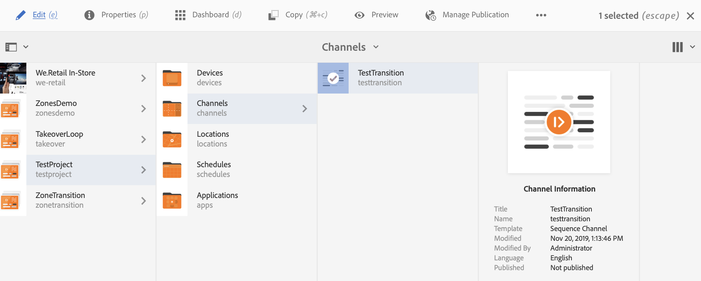
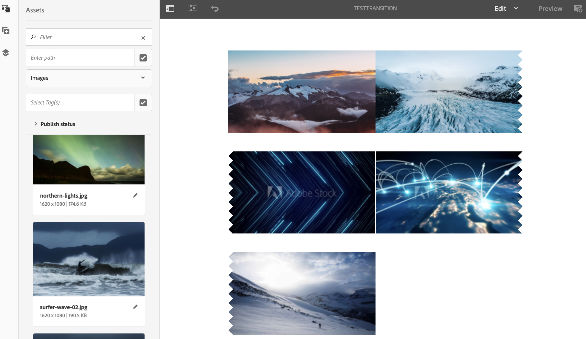
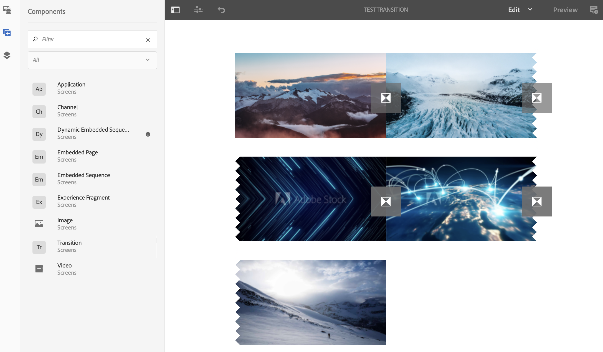
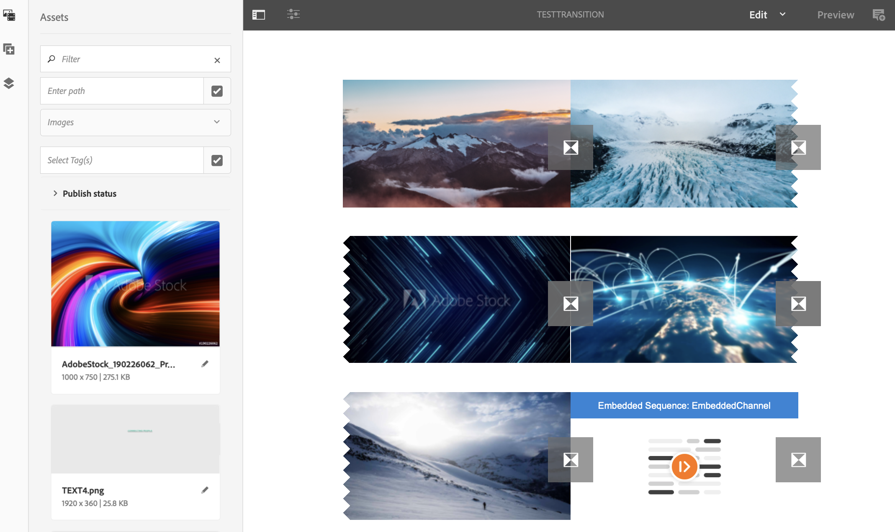

# Applying Transitions {#applying-transitions}

This section describes how you can apply the **Transition** component in-between different assets (images and videos) and embedded sequences in a channel.

>[!CAUTION]
>
>To learn in detail about the properties for the **Transition** component, refer to [Transitions](adding-components-to-a-channel.md#transition).

## Adding Transition Component to Assets in a Channel {#adding-transition}

Follow the steps below to add a transition component to your AEM Screens project:

>[!NOTE]
>
>**Prerequisites**
>
>Create an AEM Screens project **TestProject** with a channel **TestTransition**. Additionally, set up a location and a display to view the output.

1. Navigate to the Channel **TestTransition** and click **Edit** from the action bar.

   

   >[!NOTE]
   >
   >The **TestTransition** channel already has few assets (images and videos) in it. For example, the **TestTransition** channel includes three images and two videos, as shown below:
   
   
   

1. Drag and drop the **Transition** component to your editor.
   >[!CAUTION]
   >
   >Before you add the transition to your assets in your channel, make sure you do not add transition before the first asset in the sequential channel. The first item in your channel must be an asset and not a transition.

   

   >[!NOTE]
   >
   >By default, the properties of the transition component such as **Type** is set to **Fade** and the **Duration** is set to *1600 ms*.  Additionally,  it is not advisable to set a transition duration time that is longer than the asset it is being applied to.

1. Additionally, if you add an **Embedded Sequence** component (that includes a sequence channel) to this channel editor, you can add a transition component at the end, so that the content plays in order, as demonstrated in the figure below:

   
 
