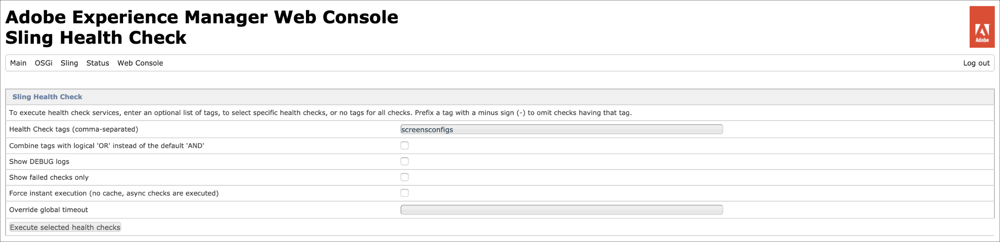
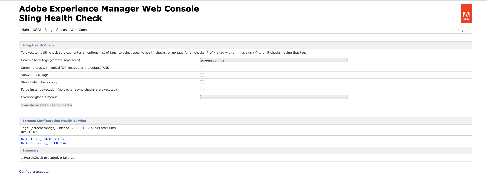
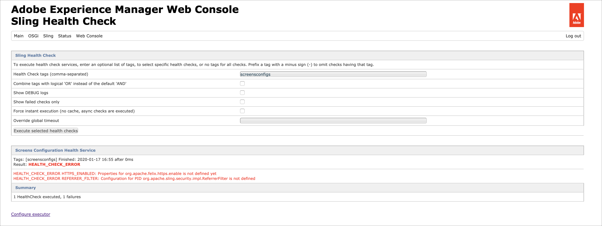
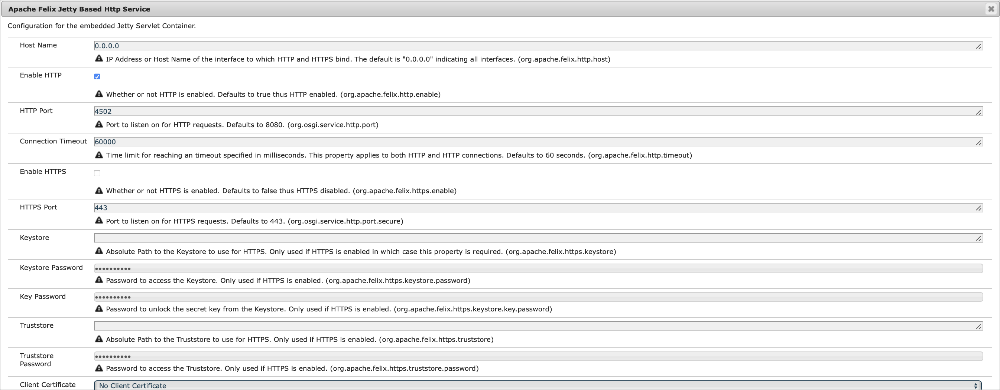

# Configuring and Deploying AEM Screens {#configuring-and-deploying-aem-screens}

This page shows how to install and configure the Screens players on your devices.

## Server Configuration {#server-configuration}

>[!NOTE]
>
>**Important**:
>
>AEM Screens player does not make use of the Cross-Site Request Forgery (CSRF) token. Therefore, in order to configure and AEM server to be ready to use for AEM Screens, skip the referrer filter by allowing empty referrers.

## Health Check Framework {#health-check-framework}

The Health Check framework allows the user to check if two necessary configurations are set up before running an AEM Screens project. 

It allows the user to verify the following two configuration checks to run an AEM Screens project, that is, to check the state of the following two filters:

1. **Allow Empty Referrer**
2. **https**

Follow the steps below to check if these two vital configurations are enabled for AEM Screens:

1. Navigate to [Adobe Experience Manager Web Console
Sling Health Check](http://localhost:4502/system/console/healthcheck?tags=screensconfigs&overrideGlobalTimeout=).

   

2. Click on **Execute selected health checks** to run the vaildation for two properties listed above.

   If both the filters are enabled, then the **Screens Configuration Health Service** shows the **Result** as **OK** with both the configurations as enabled.

   

   If one or both the filters are disabled, then an alert is displayed for the user, as hown in the figure below.

   The following alert showcases if both the filters are disabled:
    

>[!NOTE]
>
>* To enable the **Apache Sling Referrer Filter**, refer to [Allow Empty Referrer Requests](/help/user-guide/configuring-screens-introduction.md#allow-empty-referrer-requests).
>* To enable the **HTTP** service, refer to [Apache Felix Jetty Based HTTP Service](/help/user-guide/configuring-screens-introduction.md#allow-apache-felix-service).

### Prerequisites {#prerequisites}

The following key points below helps to configure and AEM server to be ready to use for AEM Screens.

#### Allow Empty Referrer Requests {#allow-empty-referrer-requests}

1. Navigate to **Adobe Experience Manager Web Console Configuration** via AEM instance --&gt; hammer icon --&gt; **Operations** --&gt; **Web Console**.

   

1. **Adobe Experience Manager Web Console Configuration** opens. Search for sling referrer.

   For searching the sling referrer property, press **Command+F** for **Mac** and **Control+F** for **Windows**.

   

1. Check the **Allow Empty** option, as shown in the figure below.

   

1. Click **Save** to enable the Apache Sling Referrer Filter Allow Empty.

#### Apache Felix Jetty Based HTTP Service {#allow-apache-felix-service}

1. Navigate to **Adobe Experience Manager Web Console Configuration** via AEM instance --&gt; hammer icon --&gt; **Operations** --&gt; **Web Console**.

   

1. **Adobe Experience Manager Web Console Configuration** opens. Search for Apache Felix Jetty Based HTTP Service.

   For searching this property, press **Command+F** for **Mac** and **Control+F** for **Windows**.

1. Check the **ENABLE HTTP** option, as shown in the figure below.

   

1. Click **Save** to enable the *http* service.

#### Enable Touch UI for AEM Screens {#enable-touch-ui-for-aem-screens}

AEM Screens requires TOUCH UI and will not work with CLASSIC UI of Adobe Experience Manager (AEM).

1. Navigate to *&lt;yourAuthorInstance&gt;/system/console/configMgr/com.day.cq.wcm.core.impl.AuthoringUIModeServiceImpl*
1. Ensure that the **Default authoring UI mode** is set to **TOUCH**, as shown in the figure below

Alternatively, you can also perform the same setting using *&lt;yourAuthorInstance&gt; *-&gt;* tools (hammer icon)* -&gt; **Operations** -&gt; **Web Console** and search for **WCM Authoring UI Mode Service**.

>[!NOTE]
>
>You can always enable Classic UI for specific users using user preferences.

#### AEM in NOSAMPLECONTENT runmode {#aem-in-nosamplecontent-runmode}

Running AEM in production uses the **NOSAMPLECONTENT** runmode. Removethe*X-Frame-Options=SAMEORIGIN* header (in the additional response header section) from

`https://localhost:4502/system/console/configMgr/org.apache.sling.engine.impl.SlingMainServlet`.

This is required for the AEM Screens Player to play online channels.

#### Password Restrictions {#password-restrictions}

With latest changes to ***DeviceServiceImpl***, you do not have to remove the password restrictions.

You can configure ***DeviceServiceImpl*** from the link below to enable password restriction while creating the password for the screens device users:

`https://localhost:4502/system/console/configMgr/com.adobe.cq.screens.device.impl.DeviceService`

Follow the steps below to configure ***DeviceServiceImpl***:

1. Navigate to **Adobe Experience Manager Web Console Configuration** via AEM instance --&gt; hammer icon --&gt; **Operations** --&gt; **Web Console**.

1. **Adobe Experience Manager Web Console Configuration **opens. Search for deviceservice. For searching the property, press **Command+F** for **Mac** and **Control+F** for **Windows**.

#### Dispatcher Configuration {#dispatcher-configuration}

To learn how to configure dispatcher for an AEM Screens project, refer to [Configuring Dispatcher for an AEM Screens project](dispatcher-configurations-aem-screens.md).

#### Java encoding {#java-encoding}

Set the ***Java encoding*** to Unicode. For example, *Dfile.encoding=Cp1252* will not work.

>[!NOTE]
>
>**Recommendation:**
>
>It is recommended to use HTTPS for AEM Screens Server in production use.

