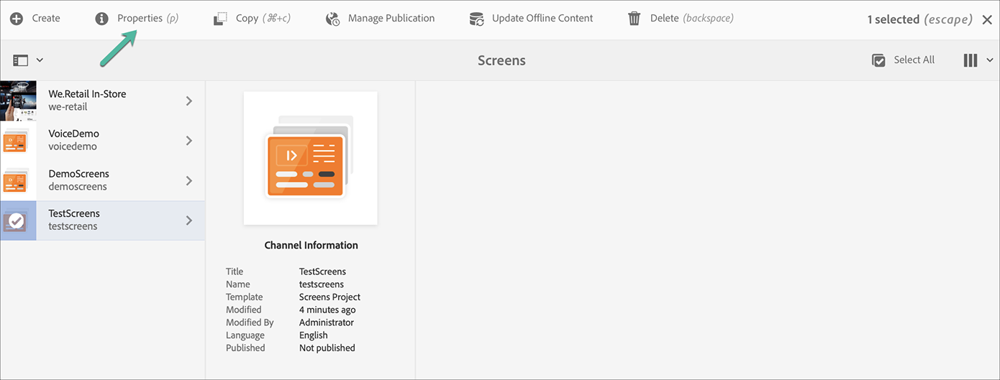
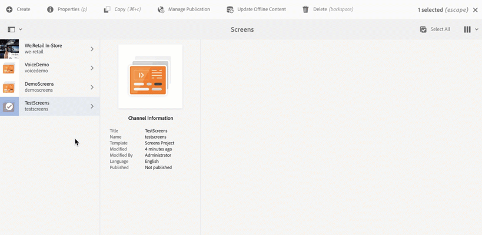

# Creating and Managing Projects {#creating-and-managing-projects}

The AEM Screens is available by selecting the Adobe Experience Manager link (top left) and then Screens.

Alternatively, you can navigate directly to: `http://localhost:4502/screens.html/content/screens`

>[!NOTE]
>**Navigation Tip:**
>You can also use the cursor keys to navigate through different folders in AEM. Also, after you click a particular entity, press the space bar to edit or view properties for that specific folder.

## Creating a New Screens Project

1. Click **Screens** from your AEM instance.
1. Click **Create Screens Project**.
1. Enter the title as **TestScreens** and click **Save**.

The project is created and it brings you back to the Screens Project console. You can now click your project.

In a project, there are five kinds of folders, as shown in the figure below:

* **Schedules**
* **Locations**
* **Applications**
* **Devices**
* **Channels**

>[!NOTE]
>
>By default, the initial structure contains the **Schedules**, **Locations**, **Applications**, **Channels**, and **Devices** primary pages, but this structure can be manually adjusted if needed. You can remove the options if the available ones are not relevant to your project.

## Viewing Properties {#viewing-properties}

After you create the Screens project, click the project and click **Properties** from the action bar so you can edit the properties of your project.

The following options allow you to edit/change properties of your **TestScreens**.

## Creating a Custom Folder {#creating-a-custom-folder}

You can also create your own custom folder under the **Schedules**, **Locations**, **Applications**, **Channels**, and **Devices** primary pages that are available in your project.

To create a custom folder:

1. Click your project and click **Create** next to the plus icon in the action bar.
1. The **Create** wizard opens and click the appropriate option.
1. Click **Next**.
1. Enter the properties and click **Create**.

The following steps show the creation of an applications folder to your **Applications** primary page in **TestScreens**.

### The Next Steps {#the-next-steps}

When you have created your own project, see [Channel Management](managing-channels.md) to create and manage content in your channel.
