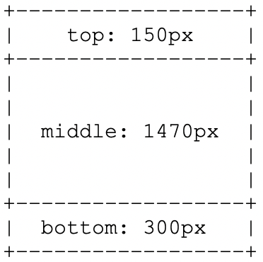

# Creating Custom Templates in MultiZone Layouts {#creating-custom-templates-multizone}

The following example showcases how you can create a custom templates in a multiZone layouts.

For example, the section below demonstrates the creation of custom template in a multizone layout with the following configurations:




## Creating Custom Template with a Specific Configuration {#basic-flow-setting}

Follow the steps below to create a custom template.

1. Create the template in `/apps/<project>/templates/my-custom-layout`

```shell
<?xml version="1.0" encoding="UTF-8"?>
<jcr:root xmlns:sling="http://sling.apache.org/jcr/sling/1.0" xmlns:cq="http://www.day.com/jcr/cq/1.0" xmlns:jcr="http://www.jcp.org/jcr/1.0" xmlns:nt="http://www.jcp.org/jcr/nt/1.0"
    jcr:description="My Custom 3-zones layout "
    jcr:primaryType="cq:Template"
    jcr:title="3-zones layout"
    allowedParents="[/libs/screens/core/templates/channelfolder]"
    allowedPaths="[/content/screens(/.*)?]"
    ranking="{Long}20000">
    <jcr:content
        cq:cssClass="aem-Layout aem-Layout--3x1 my-CustomLayout"
        cq:designPath="/apps/settings/wcm/designs/<project>"
        cq:deviceGroups="[mobile/groups/responsive]"
        jcr:primaryType="cq:PageContent"
        sling:resourceSuperType="screens/core/components/channel"
        sling:resourceType="screens/core/components/multiscreenchannel">
        <r1c1
            cq:cssClass="aem-LayoutCell--1-1 my-CustomLayout-top"
            jcr:primaryType="nt:unstructured"
            sling:resourceType="wcm/foundation/components/responsivegrid"/>
        <r2c1
            cq:cssClass="aem-LayoutCell--1-1 my-CustomLayout-middle"
            jcr:primaryType="nt:unstructured"
            sling:resourceType="wcm/foundation/components/responsivegrid"/>
        <r3c1
            cq:cssClass="aem-LayoutCell--1-1 my-CustomLayout-bottom"
            jcr:primaryType="nt:unstructured"
            sling:resourceType="wcm/foundation/components/responsivegrid"/>
        <cq:responsive jcr:primaryType="nt:unstructured">
            <breakpoints jcr:primaryType="nt:unstructured"/>
        </cq:responsive>
        <offline-config/>
    </jcr:content>
</jcr:root>
```

1. Create a Page Design in `/apps/settings/wcm/designs/<project>`.

   >[!NOTE]
   >
   >Make sure the `cq:designPath` above matches the path.

1. Update the **offline-config** node for the design to point to the new path as well

1. Add a **static.css** file in the `/apps/settings/wcm/designs/<project>` folder and set its content to

```shell
.cq-Screens-channel--multizone.my-CustomLayout {}
.cq-Screens-channel--multizone.my-CustomLayout .my-CustomLayout-top { height: 150px; }
.cq-Screens-channel--multizone.my-CustomLayout .my-CustomLayout-middle { height: 1470px; }
.cq-Screens-channel--multizone.my-CustomLayout .my-CustomLayout-bottom { height: 300px; }
```

## Inserting an image as the Background Layer  {#inserting-image}

You can inset an image as a background layer to the layout:

You can adjust the CSS rule to use what is called “data-uri” and directly inline the image (Base64 encoded) in the CSS file. 

This is done as follows:
`.cq-Screens-channel--multizone.my-CustomLayout { background: url('data:image/…;base64,…') no-repeat center center; }`
 
Or, you can follow the steps below:

1. Make sure the image is somehow included in the offline config for the channel
1. Use a direct link to the image in the CSS above, instead of the “data-uri” variant


## Updating Background Color {#updating-color}

To change the background color, add the following code to the xml file:

`.cq-Screens-channel--multizone.my-CustomLayout { background-color: …; }`
