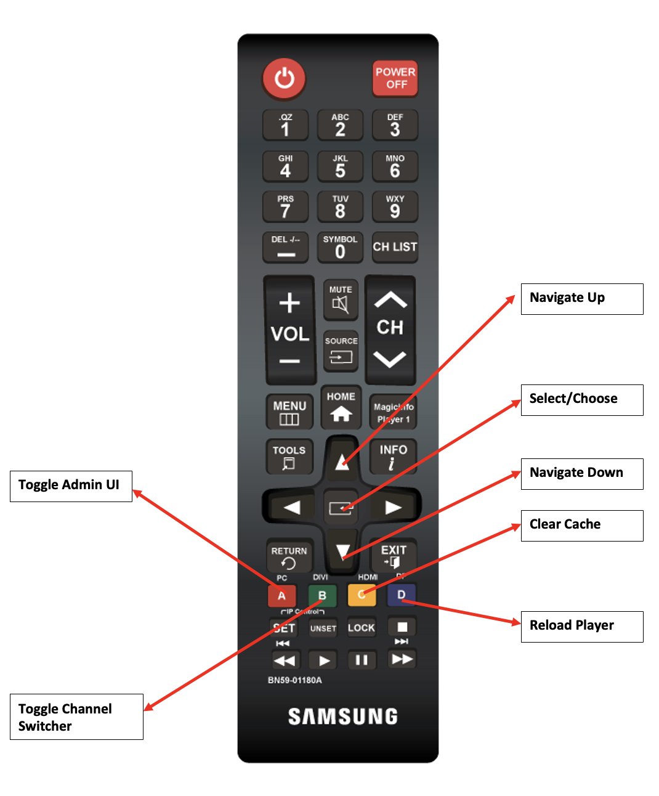

# Using the Screens Remote Control {#implementing-remote-control}

The remote control feature makes it easier to access the Admin UI, channel switcher, or features such as Clear Cache and reload. Also, it provides you with a method to see the local firmware version and system information on the player. This ability is especially useful because it can be difficult to connect a mouse. Or, operate on production devices that are out of reach and even more so if the player has lost connection with AEM. It is also useful when using Samsung RMS because the resolution difference can make it difficult to locate and open the Admin UI using a mouse. 

## Common Remote Control Key Combinations {#using-common-remote-control}

On all players you can use the following key combinations in the Screens Remote Control:

1. Toggle admin UI - CTRL + 1
1. Toggle channel switcher - CTRL + 2
1. Clear cache - CTRL + ALT + 3 
1. Reload player - CTRL + 4 

## Tizen specific Remote Control Key Combinations {#using-tizen-remote-control}

Specific to the Tizen player, you can use either the hardware remote or the software remote available in Samsung RMS to access these features:

1. A - Toggle Admin UI
1. B - Toggle Channel switcher 
1. C - Clear cache
1. D - Reload player

## More usage notes {#using-additional-remote-control}

1. With the Admin UI open, you can use the up and down arrows to navigate the tabs to view information across the tabs. 
1. With the channel switcher open, you can use the up and down arrow keys to navigate the channels. You can also press the `Enter` key (or the button at the center of the arrows on the remote) to switch channels. 

The following diagram illustrates the key usage on a Samsung remote:


>[!NOTE]
>If you set the device configuration values of enableAdminUI and/or enableOSD to false, the remote does not toggle the Admin UI and channel switcher. You cannot use the arrow keys to navigate the Admin UI or channels. However, you can still clear the cache and reload the player. You can disable the remote control feature if any of the keyboard combinations conflict with your interactive content using this code: 

```
require(['util/ScreensDisplay'], function() {window.ScreensDisplay.ignoreRemoteControl = true;}); 
```
