# Kickstart Guide {#kickstart-guide}

The kickstart to AEM Screens demonstrates how to set up and run an AEM Screens project. It walks you through setting up a basic digital signage experience and adding content such as assets and/or videos to each channel and further publishing the content to an AEM Screens player.

>[!NOTE]
>Before you start working on the project details, make sure you have installed the latest Feature Pack for AEM Screens. You can download the latest feature pack from the [Software Distribution Portal](https://experience.adobe.com/#/downloads/content/software-distribution/en/aem.html) using your Adobe ID.

## Prerequisites {#prerequisites}

Follow the steps below to create a sample project for AEM Screens and further publish content to Screens player.

>[!NOTE]
>The following tutorial showcases playing the contents of your channel in Chrome OS player.

>[!IMPORTANT]
>**OSGi Configuration Settings**
>You must enable the empty referrer to allow the device to post data to the server. For example, if the empty referrer property is disabled, the device cannot post a screenshot back. Currently some of these features are only available if the Apache Sling Referrer Filter Allow Empty is enabled in the OSGi Configuration. The dashboard may display a warning that security settings may prevent some of these features from working.
>Follow the steps below to enable the ***Apache Sling Referrer Filter Allow Empty***:

## Allow Empty Referrer Requests {#allow-empty-referrer-requests}

1. Navigate to **Adobe Experience Manager Web Console Configuration** via AEM instance --&gt; hammer icon --&gt; **Operations** --&gt; **Web Console**.

   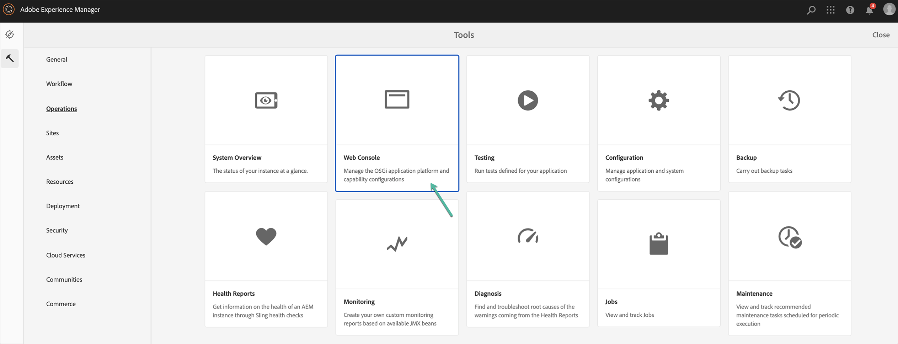

1. **Adobe Experience Manager Web Console Configuration** opens. Search for sling referrer.

   For searching the sling referrer property, press **Command+F** for **Mac** and **Control+F** for **Windows**.

1. Check the **Allow Empty** option, as shown in the figure below.

    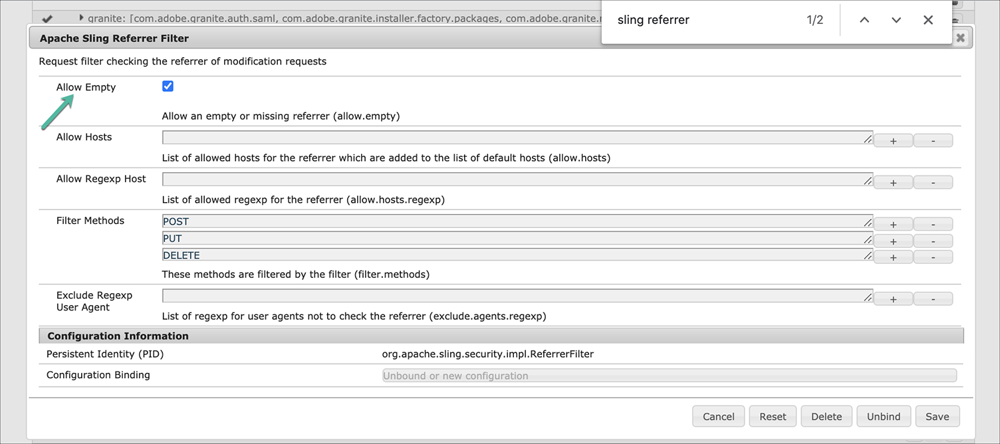
    
1. Click **Save** to enable the Apache Sling Referrer Filter Allow Empty.

## Creating a Digital Signage Experience in 5 minutes {#creating-a-digital-signage-experience-in-minutes}

### Creating an AEM Screens Project {#creating-project}

The first step is to create an AEM Screens project.

1. Navigate to your Adobe Experience Manager (AEM) instance and click **Screens**. Alternatively, you can navigate directly from `https://localhost:4502/screens.html/content/screens](https://localhost:4502/screens.html/content/screens`.

1. Click **Create Screens Project** to create a new Screens project. Enter the title as **DemoScreens** and click **Save**.

   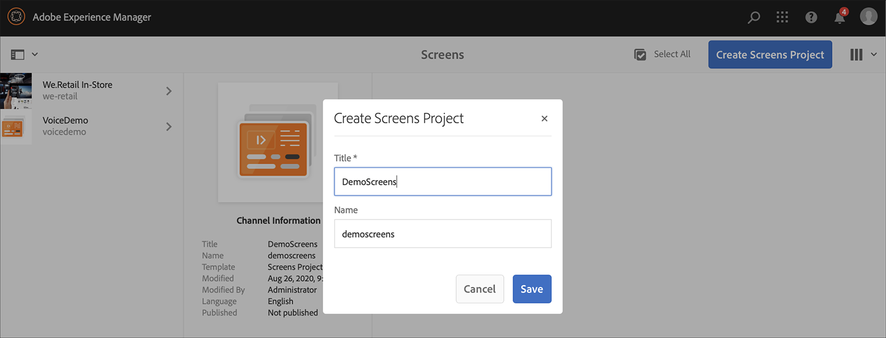

   >[!NOTE]
   >Once you create the project, it brings you back to the Screens Project home page. You can now select your project. In a project, there are five different folders titled **Applications**, **Channels**, **Devices**, **Locations**, and **Schedules**.

### Creating a Channel {#creating-channel}

Once you have created your AEM Screens project, you need to create a new channel where you manage the content.

Follow the steps below to create a new channel for your project:

1. Once you create a project, select the **DemoScreens** project and select the **Channels** folder, as shown in the figure below. Click **+ Create** from the action bar.

   

1. Choose the **Sequence Channel** from the wizard and click **Next**.
   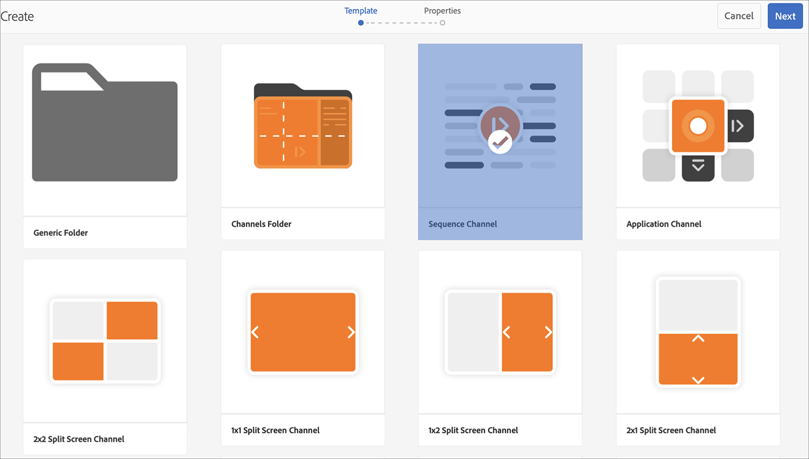

1. Enter the **Title** as **TestChannel** and click **Create**.

   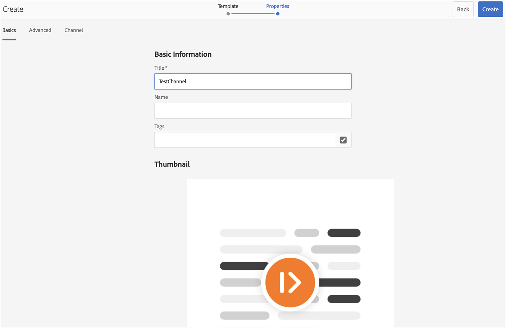

   The **TestChannel** is now added to your channels folder, as shown in the figure below.

   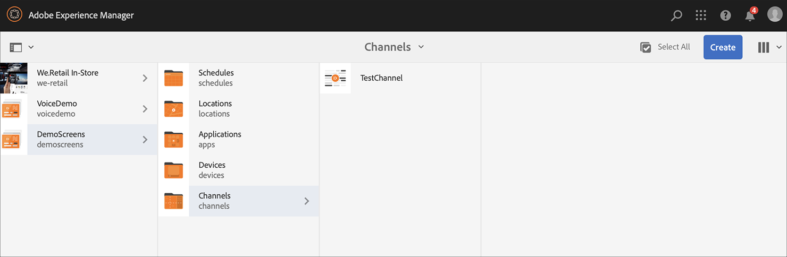

### Adding Content to a Channel {#adding-content}

Once you have your channel in place, you need to add content to your channel that AEM Screens player will display.

Follow the steps below to add content to the channel (**TestChannel**) in your project:

1. Navigate to the **DemoProject** you created and select the **TestChannel** from the **Channels** folder.

1. Click **Edit** from the action bar (see the figure below). The editor for the **TestChannel** opens.

   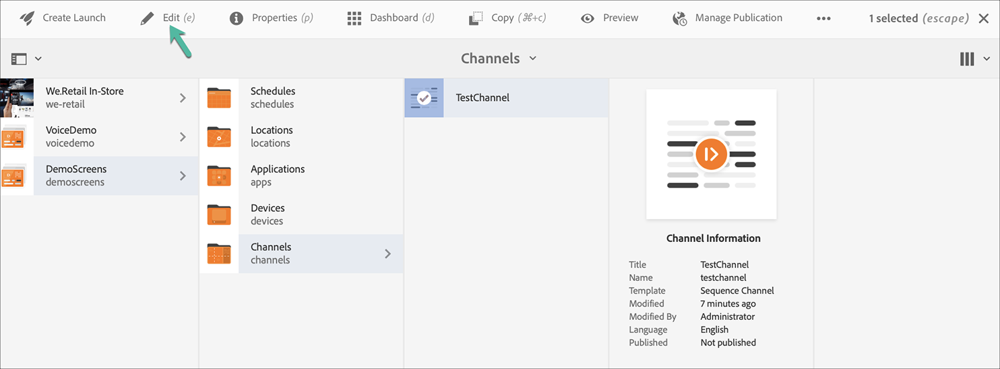

1. Click the icon that toggles side panel on left hand side of the action bar to open the assets and components.  

1. Drag and drop the components you want to add to your channel.

   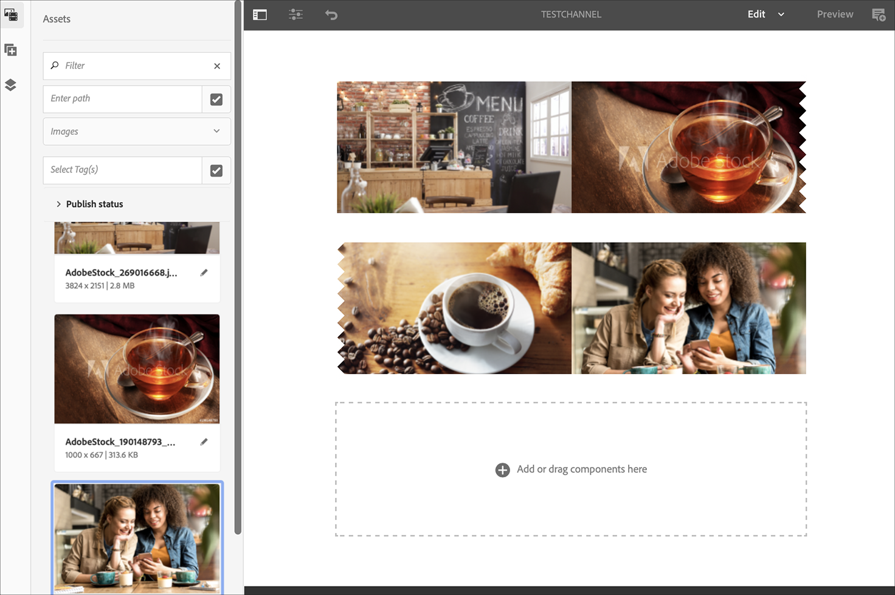

### Creating a Location {#creating-location}

Once you have your channel in place, you need to create a location.

>[!NOTE]
>***Locations*** compartmentalize your various digital signage experiences and contains the configurations of the displays according to where the various screens are.

Follow the steps below to create a new location for your project:

1. Navigate to the **DemoProject** you created and select the **Locations** folder.

1. Click **+ Create** from the action bar. 

1. Select **Location** from the wizard and click **Next**.

1. Enter the **Name** for your location (enter the title as **TestLocation**) and click **Create**. 

The **TestLocation** is created and added to your **Locations** folder.

### Creating a Display for Location {#creating-display}

Once you have created a location, you need to create a new display for your location.

>[!NOTE]
>***Display*** represents the digital experience that run on one or multiple screens.

1. Navigate to the **TestLocation** and select it. 

1. Click **Create** from the action bar.

   

1. Select **Display** from the **Create** wizard and click **Next**.

   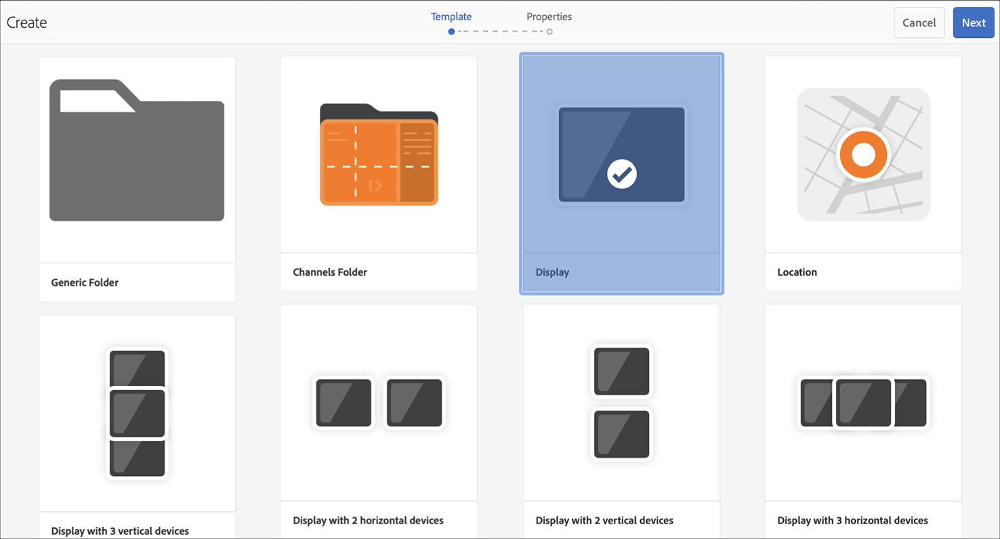

1. Enter the **Title** as **LobbyDisplay** and click **Create**.

   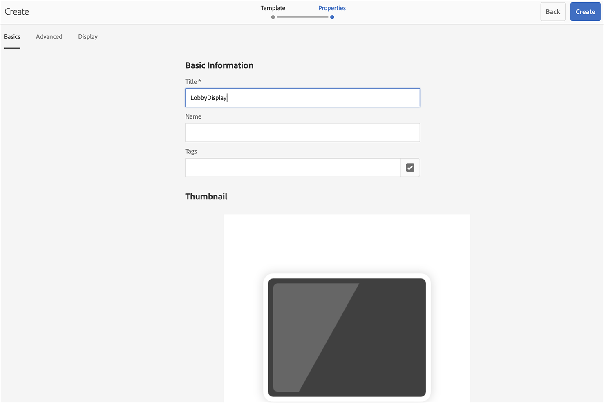

   A new display titled as **TestDisplay** is now added to your location **TestLocation**, as shown in the figure below.

   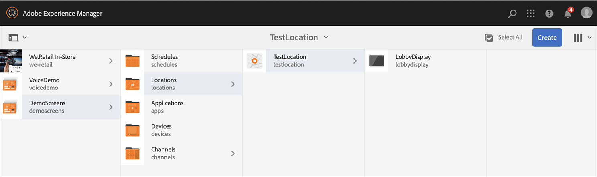

### Assigning a Channel {#assigning-channel}

Once the project set up is complete, you must assign the channel to a display to view the content.

1. Navigate to the required display from **DemoScreens** --&gt; **Locations** --&gt; **TestLocation** --&gt; **LobbyDisplay**.

1. Tap/click **Assign Channel** from the action bar.

   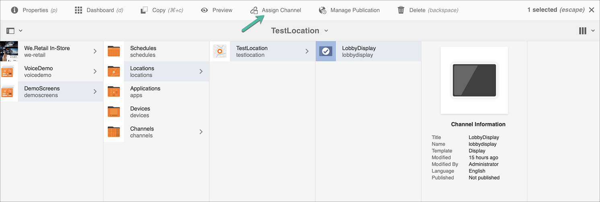

   Or,

   Tap/click **Dashboard** from the action bar and click **+Assign Channel** from the **ASSIGNED CHANNELS & SCHEDULES** panel.
  
     
      
1. The **Channel Assignment** dialog box opens.

1. From the **Settings** option, choose the channel **by path**  and **Supported Events** as **Initial Load** and **Idle Screen**.

   >[!NOTE]
   >
   >The **Channel Role**, **Priority**, and **Interruption Methods** are all populated by default. See [Channel Properties](/help/user-guide/channel-assignment-latest-fp.md#channel-properties) section to learn more about channel assignment properties.

   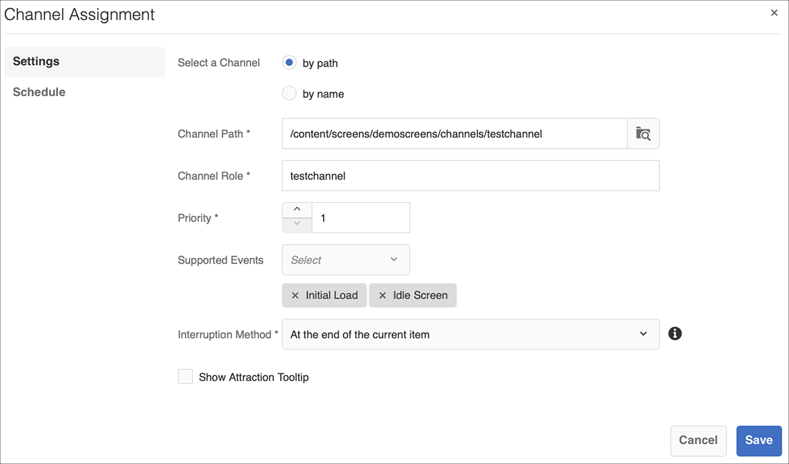

   Additionally, you can also select the **Activation Window** and **Recurrence Schedule**.

   >[!NOTE]
   >The *Recurrence Schedule* allows you to set a recurring schedule for your channel. You set up multiple recurrence schedules for a channel.
   >See [Recurrence Schedule](/help/user-guide/channel-assignment-latest-fp.md#recurrence-schedule) for more details.

1. Click **Save** once you have configured your preferences.

### Registering a Device and Assigning Device to a Display {#registering-device}

You need to register your device using the AEM dashboard. 

>[!IMPORTANT]
>Chrome OS player can be installed as Chrome Browser plugin in developer mode without requiring actual chrome player device. For installation, follow the steps below:
>
>1. Click [here](https://download.macromedia.com/screens/) to download the latest Chrome Player.
>1. Unzip and save it on disk.
>1. Open Chrome browser and select **Extensions** from the menu or directly navigate to ***chrome://extensions***.
>1. Switch on the **Developer mode** from top right corner.
>1. Click on **Load Unpacked** from top left corner and load unzipped Chrome Player.
>1. Check **AEM Screens Chrome Player** plugin if is available in the list of extensions.
>1. Open a new tab and click the **Apps** icon from the top left corner, or directly navigate to ***chrome://apps***.
>1. Click on **AEM Screens** Plugin to launch Chrome Player. By default, the player is launched in full screen mode. Press **esc** to exit full screen mode.

Once your Chrome OS player is on, follow the steps below to register a Chrome device.

1. Navigate to the **Devices** folder of your project from your AEM instance.

1. Tap/click the **Device Manager** from the action bar.

   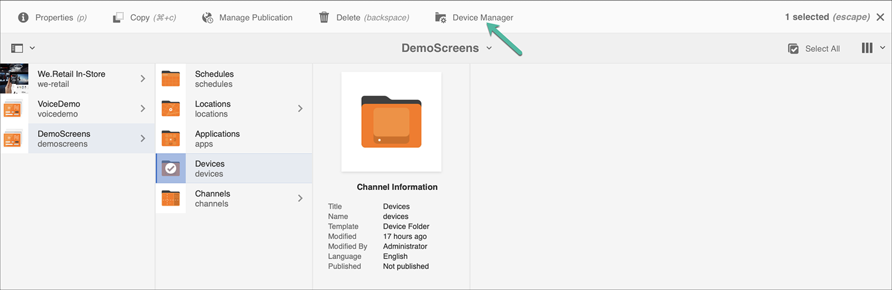   

1. Tap/click the **Device Registration** from the top right.

1. Select the required device and tap/click **Register Device**.

   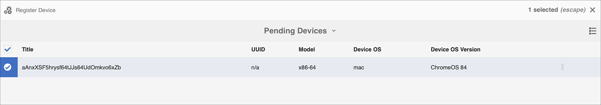   

1. Wait for the device to send its registration code and simultaneously check the **Registration Code** from your Chrome device.
   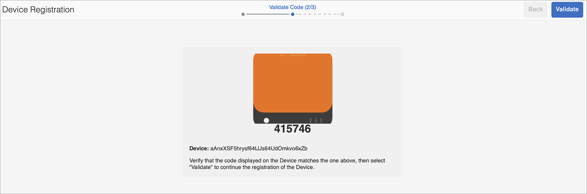

1. If the **Registration Code** is the same on both machines, tap/click **Validate** in AEM.

1. Set the desired name as **ChromeDeviceforDemo** for the device, and click **Register**.

   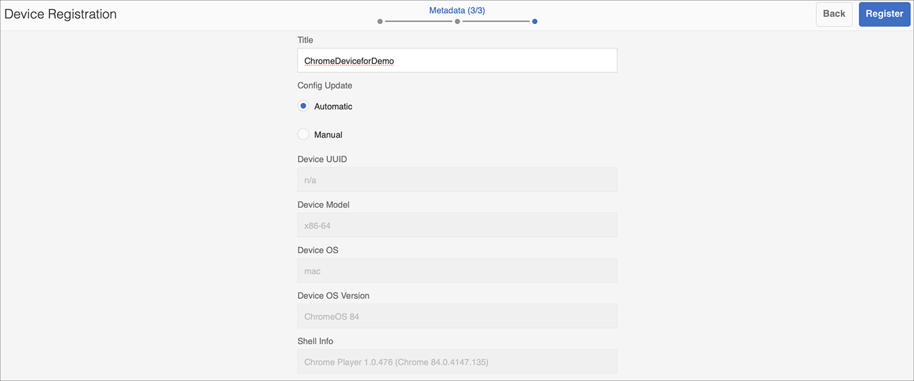

1. Click **Assign Display** from the **Device Registration Successful** dialog box.

   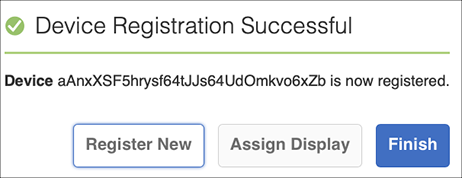

1. Select the path to your display as **DemoScreens** --&gt; **Locations** --&gt; **TestLocation** --&gt; **LobbyDisplay** and click **Assign**.
 
   

1. Once the device is successfully assigned you will see the following confirmation.

   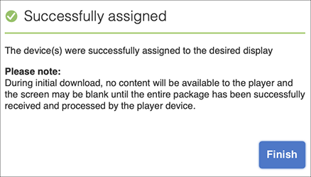

1. Tap/click **Finish** to complete the registration process. You should be able to view your registered device from the display dashboard.

   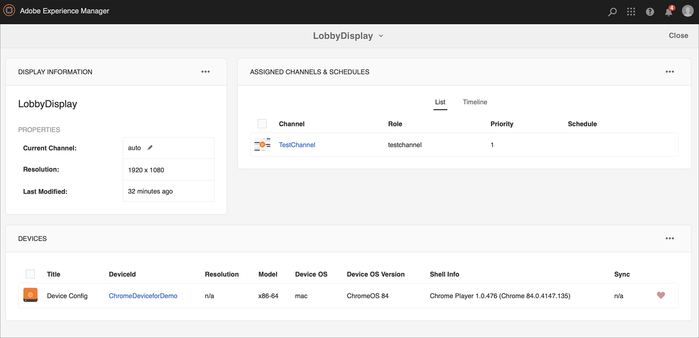

### Viewing the Content in Chrome Player {#viewing-content-output}

All the assets in your channel are now playing on your Chrome OS player.

Congratulations you are now playing content in an AEM Screens channel!

