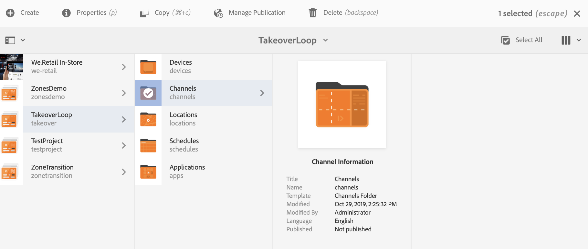
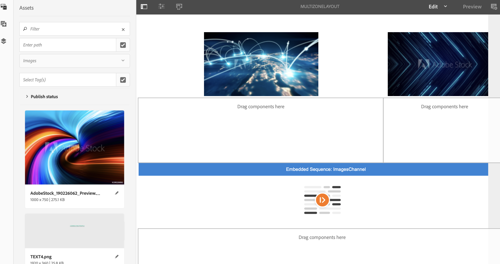
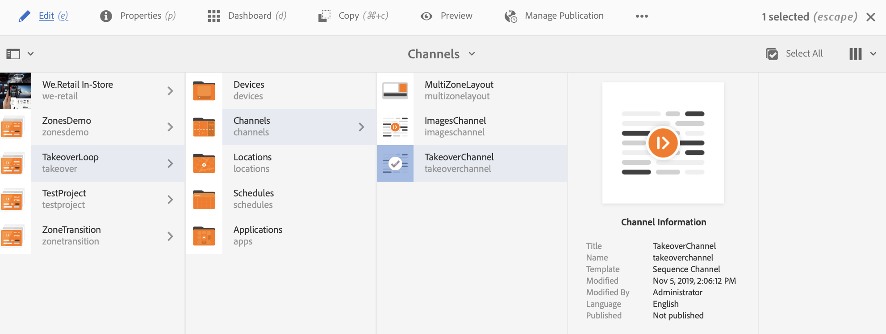
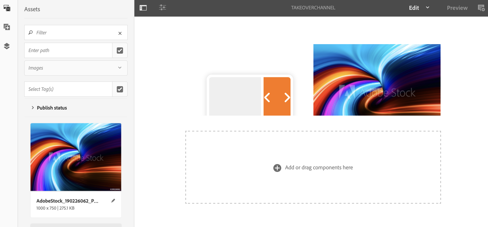
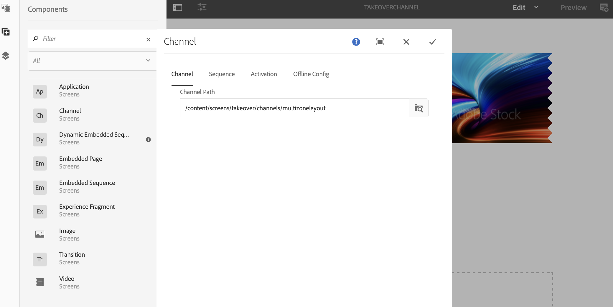
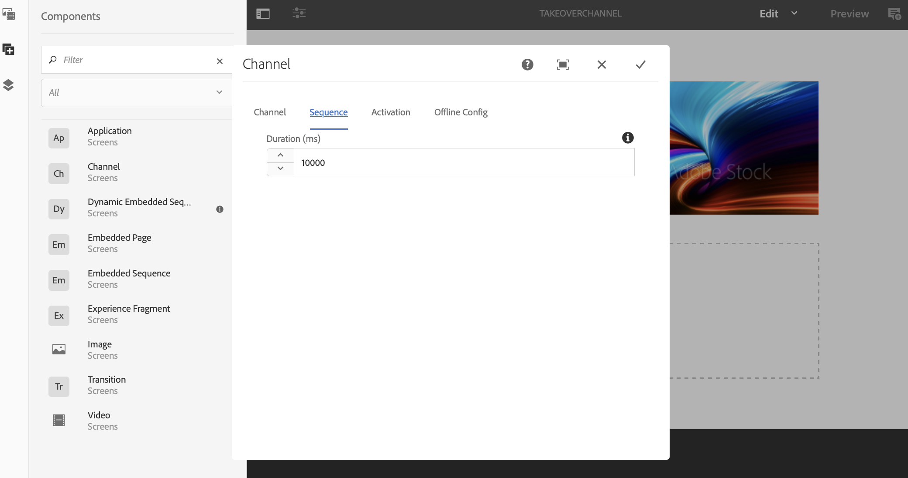
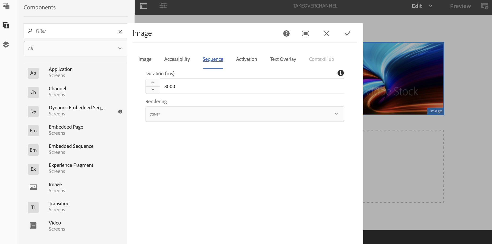

# Multi-Zone to Single-Zone Transition {#multizone-to-singlezone-use-case}

## Use case description {#use-case-description}

This section describes a use-case example that emphasizes on how to set up a multi-zone layout channel that alternates with a single-zone layout channel. The multi-zone channel has sequencing image/video assets and it shows how you can set up a project that alternates from multi-zone to single-zone and conversely.

### Preconditions {#preconditions}

Before you start this use case, make sure you understand how to:

* **[Create and Manage Channels](managing-channels.md)**
* **[Create and Manage Locations](managing-locations.md)**
* **[Create and Manage Schedules](managing-schedules.md)**
* **[Device Registration](device-registration.md)**

### Primary Actors {#primary-actors}

Content Authors

## Setting up the Project {#setting-up-the-project}

Follow the steps below to set up a project:

1. Create an AEM Screens Project named as **TakeoverLoop**, as shown below.

   

1. **Creating a Multi-Zone Screens Channel**

    1. Click the **Channels** folder and click **Create** from the action bar and opening the wizard so you can create a channel.
    1. Click **Left-L Bar Split Screen Channel** from the wizard and create the channel titled as **MultiZoneLayout**.
    1. Add content to the channel. Drag and drop the assets to each of the zones. The following example shows a **MultiZoneLayout** channel comprising a video, an image, and a text banner (in an embedded sequence), as shown below.

    

    >[!NOTE]
    >
    >To learn more about creating a multi-zone layout in your channel, see [Multi-zone Layout](multi-zone-layout-aem-screens.md).

      
1. Create another channel titled as **TakeoverChannel** to your **Channels** folder.

   

1. Click **Edit** from the action bar so you can add content to this channel. Add a **Channel** component and an image asset that you want to switch to for this channel, as shown in the figure below:

   

1. Open the settings for the Channel component and point it to the **MultiZoneLayout** channel that you created in *step 2*.

   

1. Set the duration from the **Sequence** field to **10000 milliseconds**.

      

1. Similarly, open the settings for the Image (asset you added) and set its duration from the **Sequence** field to **3000 milliseconds**.

      

## Checking the Preview {#checking-the-preview}

You can view the desired output from the player or just by selecting **Preview** from the editor.

The output demonstrates how a multi-zone layout plays for *10000 milliseconds*. Then, it switches to a single zone layout that has a playback duration of *3000 milliseconds*. And finally, it switches back to the multi-zone layout.

   >[!VIDEO](https://video.tv.adobe.com/v/30366)

>[!NOTE]
>
>You can customize your channel transition (from multi-zone to single-zone layout or conversely), as per your requirements.
