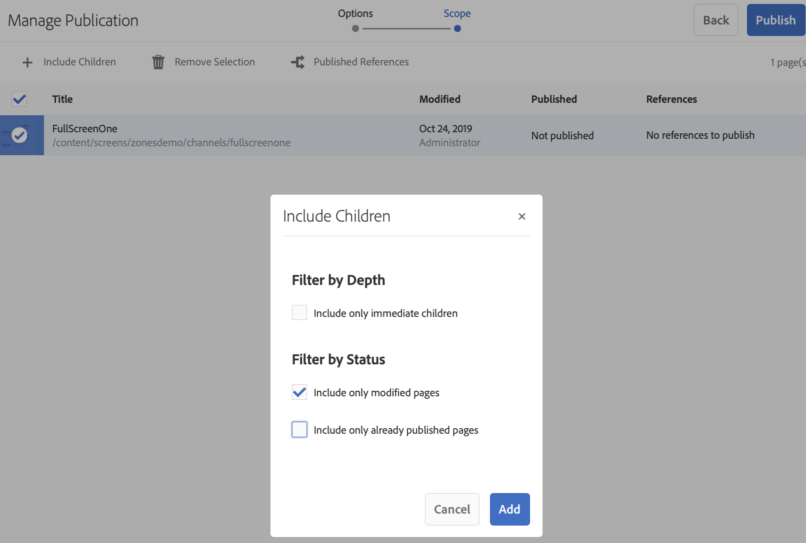

# On-Demand Content Update {#on-demand}

This section describes On-demand content for managing publications. 

## Managing Publication: Delivering Content Updates from Author to Publish to Device {#managing-publication-delivering-content-updates-from-author-to-publish-to-device}

You can publish and unpublish content from AEM Screens. The Manage Publication feature allows you to deliver content updates from author to publish to device. You can publish/unpublish content for your entire AEM Screens project or only for one of your channel, location, device, application, or a schedule.

### Managing Publication for an AEM Screens Project {#managing-publication-for-an-aem-screens-project}

Follow the steps below to deliver content updates from author to publish to device for an AEM Screens Project:

1. Navigate to your AEM Screens project.
1. Click **Manage Publication** from the action bar to publish the project to publish instance.

   

1. The **Manage Publication** wizard opens. You can select the **Action** and also schedule the publishing time for now or later. Click **Next**.

   

1. Check the box to select the entire project from **Manage Publication** wizard.

   

1. Click **+ Include Children** from the action bar and un-check all the options to publish all the modules in your project and click **Add** to publish.

   >[!NOTE]
   >
   >By default, all the boxes will be checked and you will have to manually un-check the boxes to publish all the modules in your project.

   

   **Understanding Include Children dialog box**
 
     The step mentioned above shows how you can publish the entire content. In case, you want to use the other three alternatives available, you will have to check that particular option.
     For example, the following image allows you to manage and update only the modified pages in your project:
     

     Follow the explanations below to understand the options available:

    1. **Include only immediate children**:
       This option allows you to manage updates only to the sub-nodes in your project structure.
    1. **Include only modified pages**:
       This option allows you to manage updates only to the modified pages of the project where the changes are found in your project structure.
    1. **Include only already published pages**:
       This options allows to manage updates only to the pages that were published before.

1. Click **Publish** from the **Manage Publication wizard.**

   

   >[!NOTE]
   >
   >Wait for a few seconds/minutes so that the content reaches publish instance.
   >
   >
   >    1. The workflow will not work if there are no changes in the project and nothing for **Update Offline Content**.
   >    1. The workflow will not work if author does not complete the replication process (contents are still uploading to publish instance) after clicking the **Publish** button in the managing publication workflow.

   >[!CAUTION]
   >If as an author or content creator, you want to see the changes in the devices that are attached to the author instance, click **Update Offline Content** from channel dashboard or by selecting the project. In this case, the update offline content is only performed in the author instance.

1. Navigate to the project and click **Update Offline Content** from the action bar. This action forwards the same command to publish instance, so that the offline zips are created on the publish instance as well.

   

   >[!NOTE]
   >
   >Once you have completed the manage publication workflow, and if there is a player pointing to author instance, you must trigger the update offline content in author, that will create the update offline on the author instance.

   >[!CAUTION]
   >
   >You have to trigger the update offline content in author instance, if you have a player registered to the author server. Update offline content is not required for the player registered to the publish instance.

### Managing Publication for a Channel {#managing-publication-for-a-channel}

Follow the steps below to deliver content updates from author to publish to device for a Channel in an AEM Screens Project:

>[!NOTE]
>
>Follow this section only if there are changes in a channel. If a channel does not have any changes after the previous update offline content, then the managing publication workflow for an individual channel will not work.

1. Navigate to your Screens project and select the channel.
1. Click **Manage Publication** from the action bar to publish the channel to publish instance.

   

1. The **Manage Publication** wizard opens. You can select the **Action** and also schedule the publishing time for now or later. Click **Next**.

   

1. Click **Publish** from the **Manage Publication wizard.**

   

   >[!NOTE]
   >
   >Wait for a few seconds/minutes so that the content reaches publish instance.

1. Trigger **Update Offline Content** in channel dashboard will only push the offline content to author instance but not publish instance. Steps 1-4 are for pushing offline content to publish instance.

   

   >[!CAUTION]
   >
   >You must first publish and then trigger the update offline content, as summarized in the preceding steps.

### Channel and Device Re-assignment: {#channel-and-device-re-assignment}

If you have re-assigned a device, you must publish both the initial display and the new display, once the device has been re-assigned to the new display.

Similarly, if you have re-assigned a channel, you must publish both the initial display and the new display, once the channel has been re-assigned to the new display.