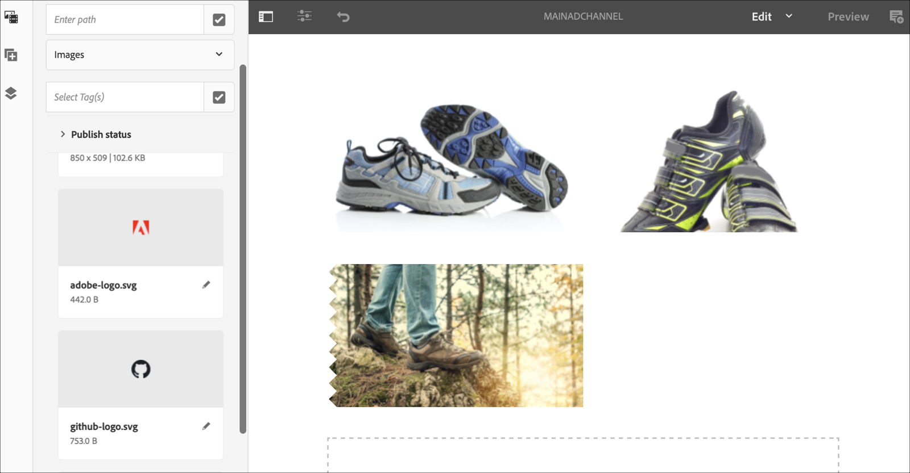
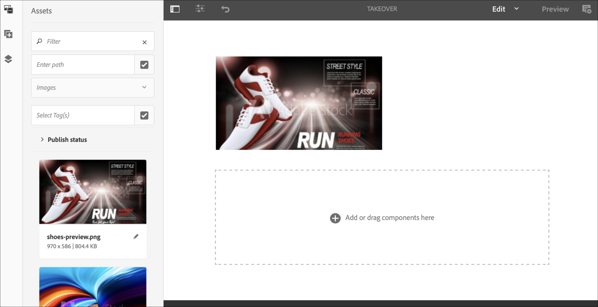
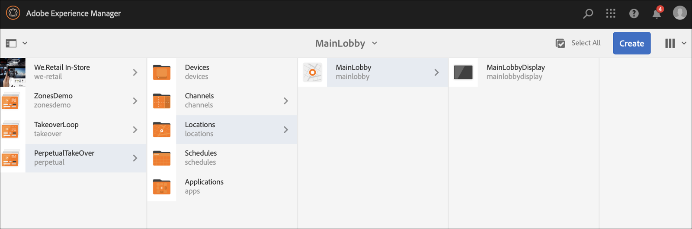
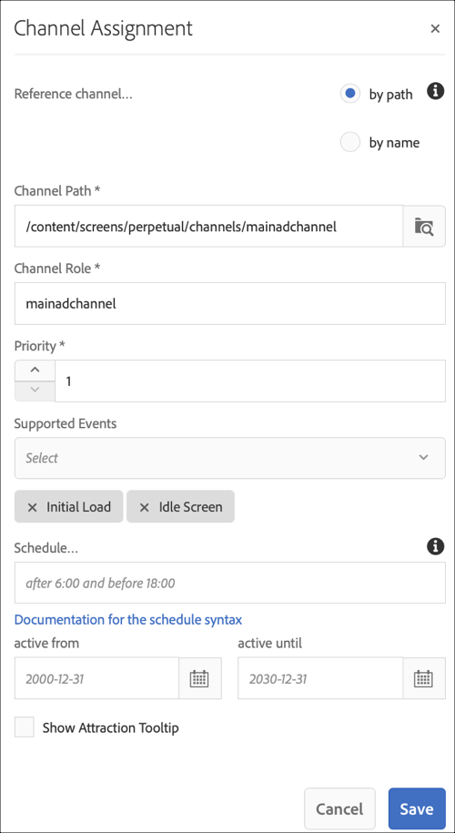
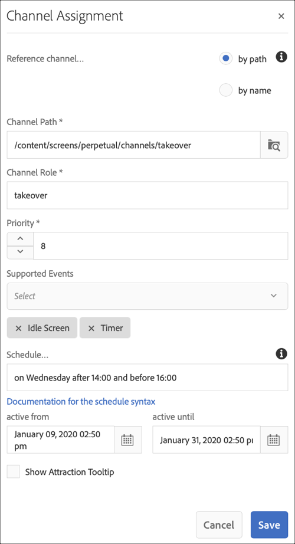

# Perpetual TakeOver Channel {#perpetual-takeover-channel}

The following page showcases a use case that emphasizes on setting up a project on how to create a Perpetual TakeOver channel that plays for a specific time day and time continuously.

## Use Case Description {#use-case-description}

This Use Case explains how to create a channel that *takes over* from the normally playing channel for a display or group of displays. The takeover will occur for a specific day and time perpetually.
For example, there is a Perpetual TakeOver channel that plays every Friday from 9AM to 10AM. During this time, no other channel should play. The following example showcases creation of a perpetual takeover channel that plays allows the content to play every Wednesday for 2 hours from 2:00 pm until 4:00 pm.

### Preconditions {#preconditions}

Before you start this use case, make sure you understand how to:

* **[Create and Manage Channels](managing-channels.md)**
* **[Create and Manage Locations](managing-locations.md)**
* **[Create and Manage Schedules](managing-schedules.md)**
* **[Device Registration](device-registration.md)**

### Primary Actors {#primary-actors}

Content Authors

## Setting up the Project {#setting-up-the-project}

Follow the steps below to set up a project:

**Setting up the Channels and Display**

1. Create an AEM Screens Project titled as **PerpetualTakeOver**, as shown below.

   

1. Create a **MainAdChannel** in the **Channels** folder.

    

1. Select the **MainAdChannel** and click **Edit** from the action bar. Drag and drop some assets (images, videos, embedded sequences) to your channel.

   

   >[!NOTE]
   >The **MainAdChannel** in this example demonstrates a sequence channel that plays content continuously.

1. Create a **TakeOver** channel that takes over the content in **MainAdChannel** and will play every Wednesday from 2:00 to 4:00 pm.

1. Select the the **TakeOver** and click **Edit** from the action bar. Drag and drop some assets to your channel. The following example showcases a single zone image added to this channel.

   

1. Set up a location and display for your channels. For instance, the following location **MainLobby** and display **MainLobbyDisplay** is set up for this project.

   

**Assigning Channels to a Display**

1. Select the display **MainLobbyDisplay** from the **Locations** folder. Click **Assign Channel** from the action bar to open **Channel Assignment** dialog box.

   >[!NOTE]
   >To learn how to assign a channel to a display, refer to **[Channel Assignment](channel-assignment.md)**.

1. Populate the fields (**Channel Path**, **Priority**, and **Supported Events**) from the **Channel Assignment** dialog box and click **Save** to assign the **MainAdChannel** to your display.

    * **Channel Path**: Select the path to the **MainAdChannel** channel
    * **Priority**: Set the priority of this channel as 1.
    * **Supported Events**: Select the **Initial Load** and **Idle Screen**.

   

1. Select the display **TakeOver** from the **Locations** folder. Click **Assign Channel** from the action bar to assign the takeover chanel.

1. To assign the **TakeOver** channel to your display at a scheduled time and populate the following fields from the **Channel Assignment** dialog box and click **Save**:

    * **Channel Path**: Select the path to the **TakeOver** channel
    * **Priority**: Set the priority of this channel greater than the **MainAdChannel**. For instance, the priority set in this example is 8.
    * **Supported Events**: Select the **Idle Screen** and **Timer**.
    * **Schedule**: Enter the text for the schedule that you want this channel to run the display. The text in the **Schedule** mentioned in this example is *on Wednesday after 14:00 and before 16:00*.
         [!NOTE]
         > To learn more about the expressions you can add to the **Schedule**, refer to the [Example Expressions](#example-expressions) section below
    * **active from**: Start date and time.
    * **active until**: End date and time.
    
    For example, the text in **Schedule** and **active from** and **active until** date and time here allows the content to play every Wednesday from 2:00 pm until 4:00 pm.
    

      

      Navigate to the display from **TakeOver** --> **Locations** --> **MainLobby** --> **MainLobbyDisplay** and click **Dashboard** from the action bar to view the assigned channels with their priorities, as shown below.

      >[!NOTE]
      >It is mandatory to set the priority of the takeover channel as the highest.

      
    Now, the **TakeOver** channel will take over the **MainAdChannel** at 2:00 pm for two hours until 4:00 pm every Wednesday and play its content from Jan 09' 2020 until Jan 31' 2020.

### Example Expressions {#example-expressions}

The following table summarizes few example expressions that you can add to the schedule while assigning channel to a display.

| **Expression** | **Interpretation** |
|---|---|
| before 8:00 am | the channel plays before 8:00 am everyday |
| after 2:00 pm | the channel plays after 2:00 pm everyday |
| after 12:15 and before 12:45 | the channel plays after 12:15 pm everyday for 30 minutes |
| before 12:15 also after 12:45 | the channel plays before 12:15 pm everyday and then also after 12:45 pm |
| on the 1st day of January after 2:00 pm also on the 2nd day of January also on the 3rd day of January before 3:00 am | the channel starts playing after 12:45 pm on January 1st, continues playing for the whole day on January 2nd all the way until 3:00 am on January 3rd |
| on the 1-2 day of January after 2:00 pm also on the 2-3 day of January before 3:00 am | the channel starts player after 12:45 pm on January 1st, continues playing until 3:00 am on January 2nd, then it starts again on January 2nd at 12:45 pm and continues playing until 3:00 am on January 3rd |

Note that you can also use _military time_ notation (i.e. 14:00) instead of am/pm notation (i.e. 2:00 pm)
