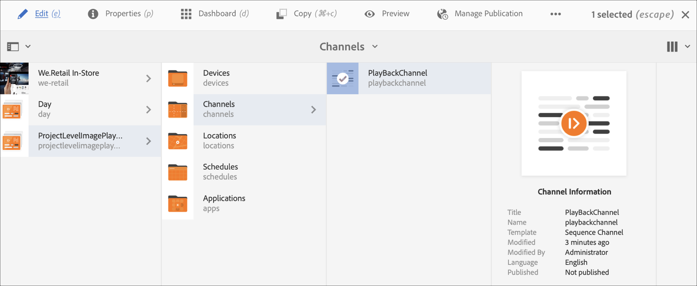
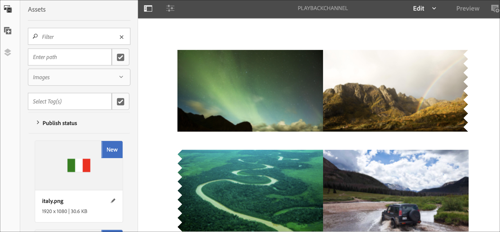
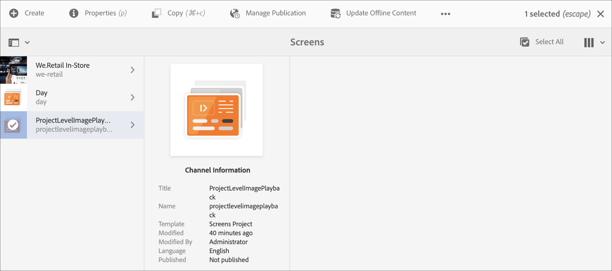

# Project Level Image Playback Duration {#project-level-image-playback}

## Overview {#overview}

This features allows you to define image playback duration at the project level. All images inherit this playback duration by default. If no duration is defined at the project level, the default playback of 8 seconds will continue.

### Prerequisites {#prerequisites}

Before you use this feature, make sure you set up a project as a prerequisite to start implementing this functionality. For example,

1. Create an AEM Screens project (in this example, **ProjectLevelPlayback**)  

1. Create a sequence channel as **PlayBackChannel** under **Channels** folder

1. Add content to **PlayBackChannel**

   

   For instance, the following image showcases the images added to the **PlayBackChannel** editor:

   

## Editing Project Level Image Playback Duration Assignment {#editing-project-level-image-playback-duration-assignment}

The section below explains how to edit the playback duration of content in an AEM Screens project.

### Updating the Playback Duration for Images at a Project Level {#updating-the-playback-duration-for-images-in-a-project}

>[!NOTE]
>If you want to update an image or channel level playback duration, refer to [Channel Level Image Playback Duration](channel-level-image-playback.md).

Follow the steps below to learn how to update Project Level Image Playback Duration:

1. Navigate to your project **ProjectLevelPlayback** and click **Properties** from the action bar.
    

1. Select all the images in the channel and click the wrench icon on the top left (as shown in the figure below) to open Channel level Configure dialog box.

   

1. **Page** dialog box opens.

   >[!NOTE]
   >
   >By default, the images in a channel are set to a playback duration of 8 seconds and the videos play at their default length of duration.

   

   Edit the **Duration** from 8000 (ms) to 3000 (ms), that is, 3 seconds. Click the check mark on the top right of the **Page** dialog box to save your changes.

   

### Viewing the Result {#viewing-the-result}

Once you have updated the channel playback duration (in this example, all three images) you will notice that the images will now play for 3 seconds rather than 8 seconds (default value).

