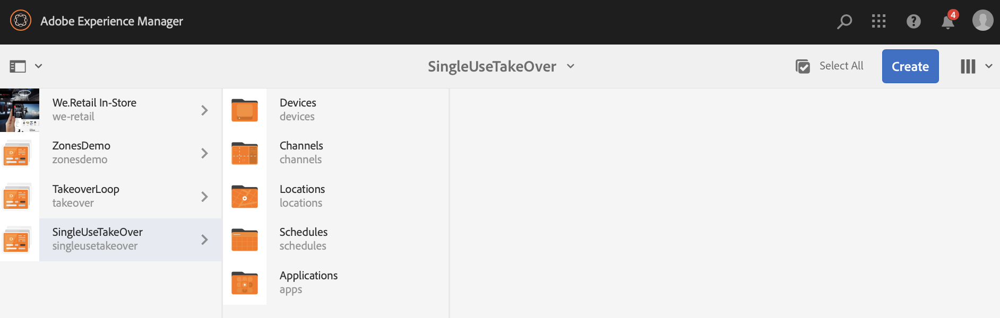
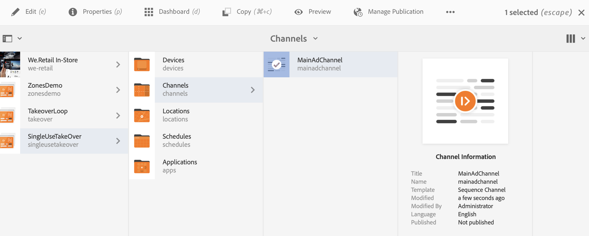
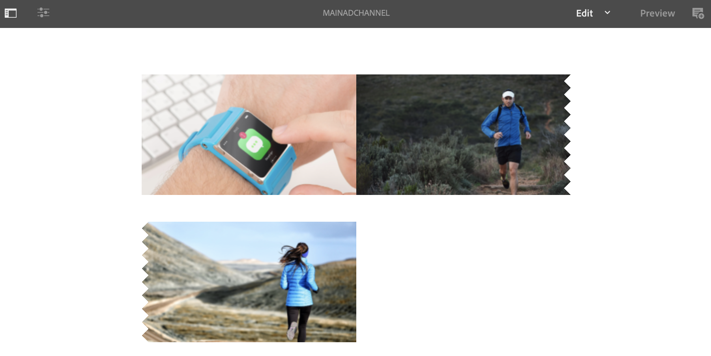
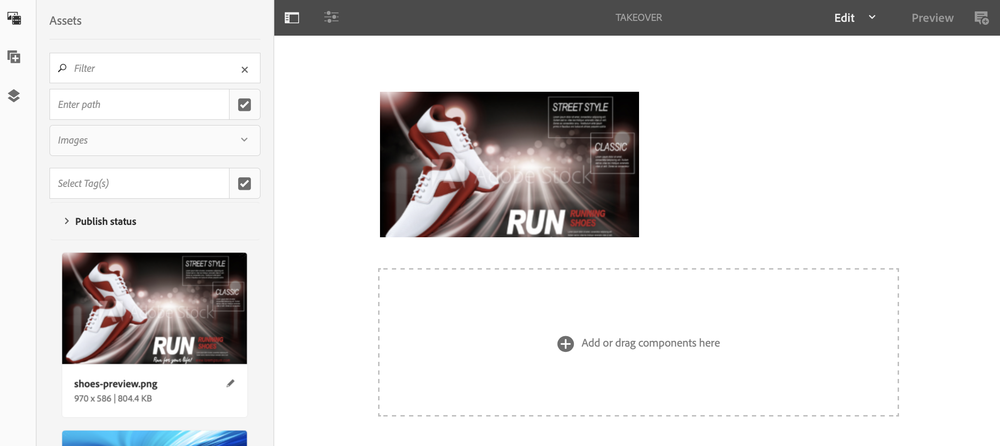
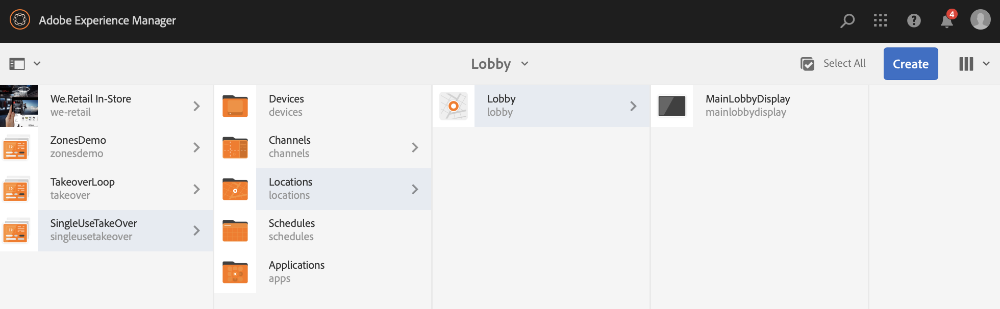
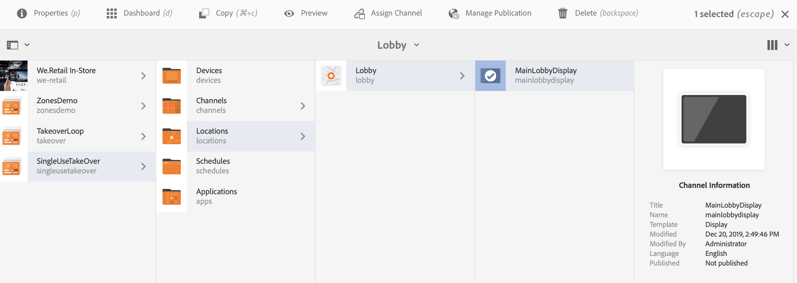
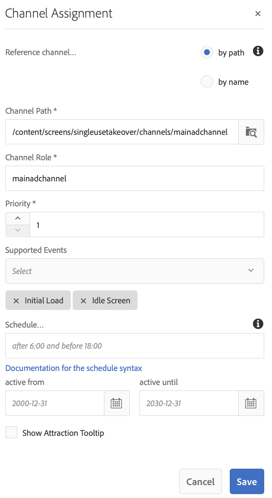
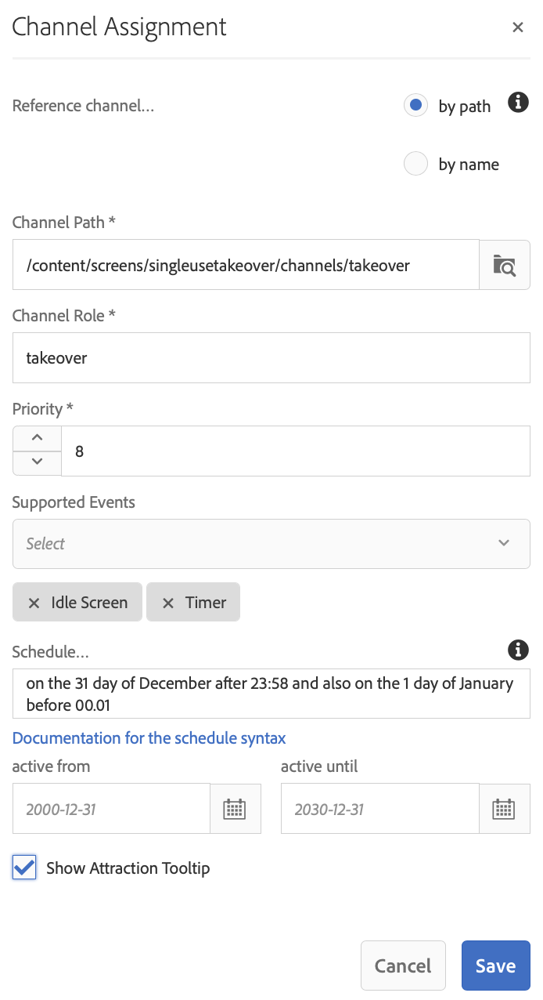

# Single Use TakeOver Channel {#single-use-takeover-channel}

The following page showcases a use case that emphasizes on setting up a project on how to create a Single TakeOver channel that plays just once for a specific time.

## Use Case Description {#use-case-description}

This Use Case explains how to create a channel that *takes over* from the normally playing channel for a display or group of displays. The takeover will only occur once and for a specific time.
For example, there is a Single TakeOver channel that plays on Friday from 9AM to 10AM. During this time, no other channel should play. Before and after this time, the Single Use Takeover channel will not play. The following example showcases creation of a single takeover channel that plays allows the content to play for 2 minutes before 12:00 am on Dec 31 until 12:01 am.

### Preconditions {#preconditions}

Before you start this use case, make sure you understand how to:

* **[Create and Manage Channels](managing-channels.md)**
* **[Create and Manage Locations](managing-locations.md)**
* **[Create and Manage Schedules](managing-schedules.md)**
* **[Device Registration](device-registration.md)**

### Primary Actors {#primary-actors}

Content Authors

## Setting up the Project {#setting-up-the-project}

Follow the steps below to set up a project:

**Setting up the Channels and Display**

1. Create an AEM Screens Project titled as **SingleUseTakeOver**, as shown below.

   

1. Create a **MainAdChannel** in the **Channels** folder.

    

1. Select the **MainAdChannel** and click **Edit** from the action bar. Drag and drop some assets (images, videos, embedded sequences) to your channel.

   

   >[!NOTE]
   >The **MainAdChannel** in this example demonstrates a sequence channel that plays content continuously.

   

1. Create a **TakeOver** channel that takes over the content in **MainAdChannel** and will play only for a specific day and time.

1. Select the the **TakeOver** and click **Edit** from the action bar. Drag and drop some assets to your channel. The following example showcases a single zone image added to this channel.

   

1. Set up a location and display for your channels. For instance, the following location **Lobby** and display **MainLobbyDisplay** is set up for this project.

   

**Assigning Channels to a Display**

1. Select the display **MainLobbyDisplay** from the **Locations** folder. Click **Assign Channel** from the action bar. 

   

   >[!NOTE]
   >To learn how to assign a channel to a display, refer to **[Channel Assignment](channel-assignment.md)**.

1. Populate the fields (**Channel Path**, **Priority**, and **Supported Events**)from the **Channel Assignment** dialog box and click **Save**. Now, you have assigned the **MainAdChannel** to your display.

   

1. Select the display **TakeOver** from the **Locations** folder. Click **Assign Channel** from the action bar to assign the single use takeover chanel.

1. To assign the **TakeOver** channel to your display at a scheduled time and populate the following fields from the **Channel Assignment** dialog box and click **Save**:

    * **Channel Path**: Select the path to the TakeOver channel
    * **Priority**: Set the priority of this channel greater than the **MainAdChannel**. For instance, the priority set in this example is 8.
    * **Supported Events**: Select the **Idle Screen** and **Timer**.
    * **Schedule**: Enter the text for the schedule that you want this channel to run the display. For example, the text here allows the content to play 2 minutes before 12:00 am on Dec 31 until 12:01 am.
    The text in the **Schedule** mentioned in this example is *on the 31 day of December after 23:58 and also on the 1 day of January before 00.01*.

      

       >[!NOTE]
       >You can mention the schedule for different use cases. Refer to Perpetual Use Case for more details.