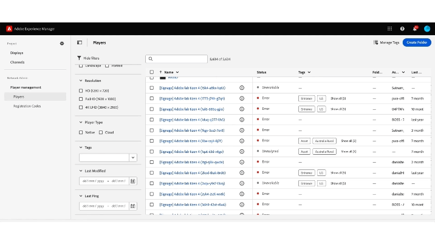

# Tagging on Screens Cloud {#tagging-on-Screens-Cloud}

>[!CAUTION]
>
>The **Tagging** feature is only available if it is enabled for your tenant. Contact AEM Screens Engineering to enable it. 

## Introduction {#introduction}

User can create tags on Screens Cloud and use them to classify displays and players.

## Create and manage tags {#create-and-manage-tags}

.

Use the same action menu to rename a tag or delete them.

>[!NOTE]
> 
> A total of 500 tags are allowed for a tenant

## Manage tags assignments {#manage-tags-assignments}

Use created tags on Displays & Players.

.

>[!NOTE]
>
> A display or a player can have at max 30 tags assigned.
> At most 30 items can be tagged in one go.

## Filter by Tags {#filter-by-tags}

Select tags to filter the list of displays or players.

.

>[!NOTE]
> 
> Tags defined on Screens Cloud are not related/synced with tags defined in AEM.
> 
