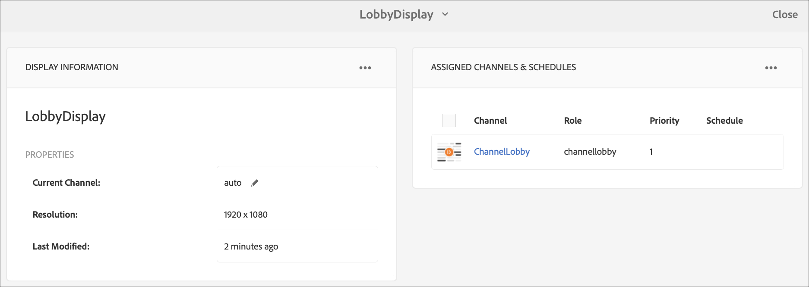
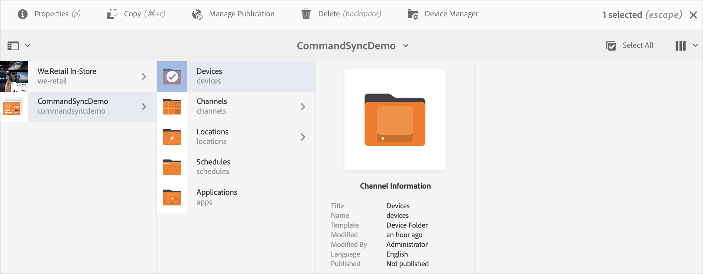
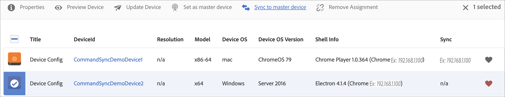
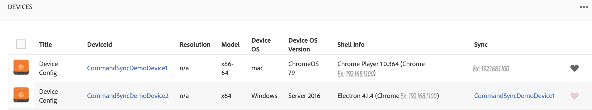
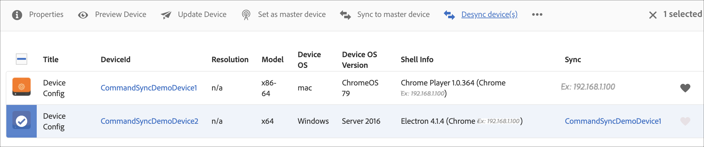

# Command Sync {#command-sync}

The following page describes how to use Command Sync. Command Sync allows synchronized playback across different players. The players can play different content but each asset must have the same duration.

>[!IMPORTANT]
>
>This feature does not support Embedded Sequences, Dynamic Embedded Sequences, Application Channels, or Transitions.

## Overview {#overview}

Digital signage solutions must support video walls and synchronized playback to support scenarios like New Year countdowns or large video sliced up to play across multiple screens and this is where Command Sync comes into play.

To use Command Sync, one player acts as a *primary* and sends command and all the other players act as *clients* and play when they receive the command. 

The *primary* sends a command to all registered clients when it is about to start playback of an item. The payload of this can be the index of the item to be played and/or the outer html of the element to be played.

## Implementing Command Sync {#using-command-sync}

The following section describes how you can use Command Sync in an AEM Screens project.

>[!NOTE]
>
>For synchronized playback, it is required that all the hardware devices have the same hardware specifications and preferably the same operating system. Synchronizing between different hardware and operating systems is not recommended.

### Setting up the Project {#setting-up}

Before you use Command Sync feature, make sure you have a project and a channel with content set up for your project.

1. The following example showcases a demo project named **CommandSyncDemo** and a sequence channel **ChannelLobby**.

   

   >[!NOTE]
   >
   >To learn how to create a channel or add content to a channel, see [Creating and Managing Channels](/help/user-guide/managing-channels.md)

   The channel contains the following content, as shown in the figure below.

   

1. Create a location **Lobby** and then a display titled as **LobbyDisplay** in the **Locations** folder, as shown in the figure below.
   

1. Assign the channel, **ChannelLobby** to your **LobbyDisplay**. You can now view the assigned channel to the display from the display dashboard.
    

   >[!NOTE]
   >
   >To learn how to assign a channel to a display, see [Creating and Managing Displays](/help/user-guide/managing-displays.md).

1. Navigate to **Devices** folder.
1. Click **Device Manager** from the action bar.

   

   >[!NOTE]
   >
   >To learn how to register a device, see [Device Registration](/help/user-guide/device-registration.md)

1. For demo purposes, this example showcases a chrome device and a windows player as two separate devices. Both the devices point to the same display.
   

### Updating Channel Settings

1. Navigate to **ChannelLobby**.
1. Click **Edit** from the action bar.
1. Click the entire channel as shown in the figure below.
   

1. Click the wrench icon.
   

1. In the **Page** dialog box, enter the *synced* keyword in the **Strategy** field.
   

### Setting up a primary {#setting-up-primary}

1. Navigate to the display dashboard from **CommandSyncDemo** > **Locations**  > **Lobby** > **LobbyDisplay** and click **Dashboard** from the action bar.
Notice the two devices (chrome and windows player) in **DEVICES** panel, as see in the following:
      

1. From the **DEVICES** panel, click the device you want to set as primary. The following example demonstrates setting up the Chrome device as the primary. Click **Set as primary device**.

    

1. Enter the IP address in **Set as primary device** and click **Save**. 

   

>[!NOTE]
>
>You can set up multiple devices as primary.

### Syncing up with Primary {#sync-up-primary}

1. After you have set the Chrome device as primary, sync the other device (in this case, the windows player) to sync with the primary.
Click the other device (in this case, windows player) from the **DEVICES** panel and click **Sync to primary device**.

   

1. Click the device from the list and click **Save**.

   >[NOTE:]
   > The **Sync to primary device** dialog box shows the list of primary devices. Select the one preferred.

1. When the device (Windows player) is synced to the primary (Chrome player), you can see the device synced in the **DEVICES** panel.

   

### De-Syncing with the Primary {#desync-up-primary}

After you have synced a device or devices to a primary, you can de-sync the assignment from that device. 

>[!NOTE]
>
>If you de-sync a primary device, it will also unlink all client devices associated with that primary device.

To remove the syncing from the primary device, follow the steps below:

1. Navigate to the **DEVICES** panel  and click the device.

1. Click **Desync devices** so you can de-sync the client from the primary device.

   

1. Click **Confirm** to de-sync the selected device from the primary.

   >[NOTE:]
   > If you click the primary device and use the de-sync option, then all the devices connected to the primary are de-synced in one step.
