# Voice Recognition in AEM Screens {#voice-recognition}

>[!IMPORTANT]
>
>**Important Privacy Information**
>
>When using the voice recognition feature, follow all applicable legal and ethical guidelines for your region. These guidelines include, but not limited to, providing a visible notice to end users that the player is using voice recognition). Adobe does not receive, store, or process any of the voice-related information. The AEM Screens players use the standard Web speech API built into the browsing engine. Behind the scenes, this API sends a wave form of your speech to Google's servers for conversion from speech to text. The player matches the text against configured keywords. 
>
>See [Google Privacy White-paper on Web speech API](https://www.google.com/chrome/privacy/whitepaper.html#speech) for more details.

The voice recognition feature allows content change in an AEM Screens channel driven by voice interaction.

A Content Author can configure a display to be voice enabled. The purpose of this feature is to let customers use speech as a method of interacting with their displays. Some similar use cases include finding product recommendations in stores, ordering menu items at diners and restaurants. This feature increases accessibility for users and can greatly enhance customer experience. 

>[!NOTE]
>The player hardware must support voice input, such as a microphone.

## Implementing Voice Recognition {#implementing}

>[!IMPORTANT]
> The voice recognition feature is available only on Chrome OS and Windows players.

To implement voice recognition in your AEM Screens project, enable the voice recognition for the Display and associate each channel with a unique tag to trigger a channel transition.

The following section describes how you can enable and use the voice recognition feature in an AEM Screens project.

## Viewing Content in Full Screen or Split Screen Channel Switch {#sequence-channel}

Before you use a voice recognition feature, make sure you have a project and a channel with content set up for your project.

1. The following example showcases a demo project named **VoiceDemo** and three sequence channels **Main**, **ColdDrinks**, and **HotDrinks**, as shown in the figure below.

   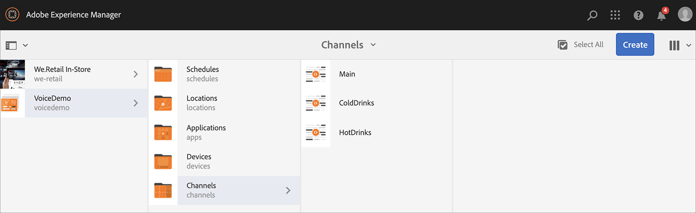

   >[!NOTE]
   >
   >To learn how to create a channel or add content to a channel, see [Creating and Managing Channels](/help/user-guide/managing-channels.md)

   Or,

   You can create three sequence channels **Main**, **ColdDrinks**, and **HotDrinks**, and one more 1x2 Split Screens channel **SplitScreen** as shown in the figure below.

   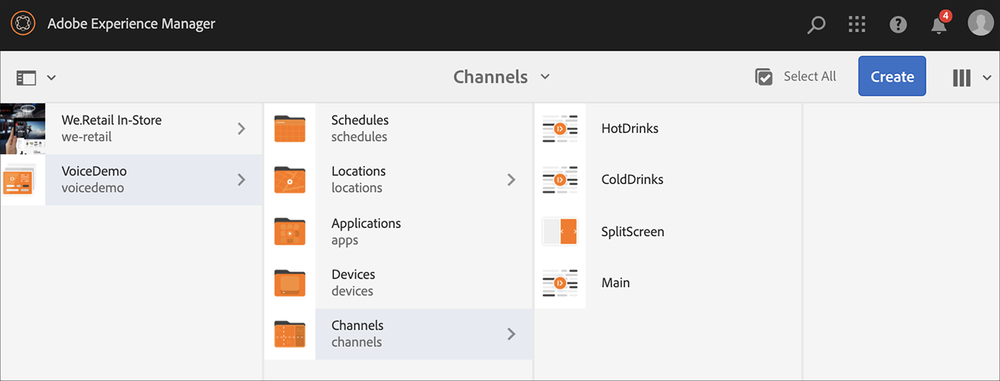

1. Navigate to each of the channels and add content. For example, navigate to **VoiceDemo** > **Channels** > **Main** and click the channel. Click **Edit** from the action bar, then add content (images/videos) as per your requirement. Similarly, add content to both **ColdDrinks** and the **HotDrinks** channel.

   The channels now contain assets (images), as shown in the figures below.

   **Main**:

   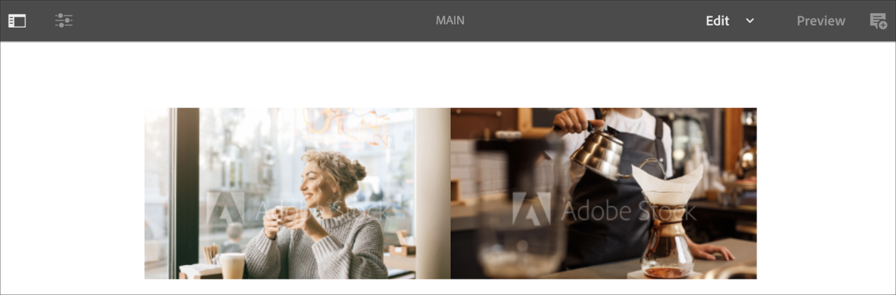

   **ColdDrinks**:

   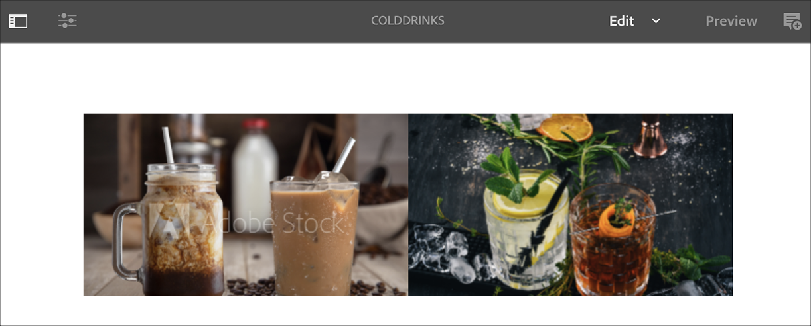
   
   **HotDrinks**:

   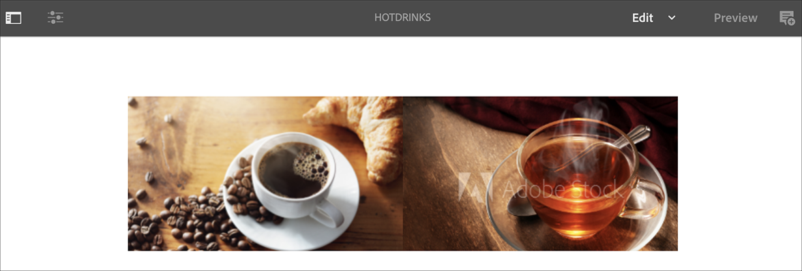

   If you added the Split Screens channel to your project, navigate to **SplitScreen** and drag-and-drop two embedded sequences. Add paths to both the **ColdDrinks** and **HotDrinks** channel as shown in the figure below.
   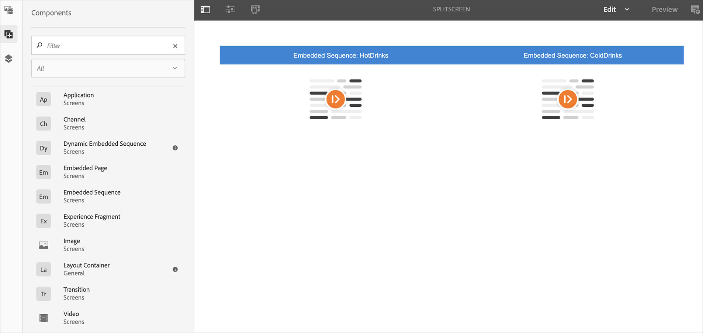

### Setting up Tags for Channels {#setting-tags}

After you have added content to your channels, navigate to each of the channels and add appropriate tags that would trigger the voice recognition.

Follow the steps below to add tags to your channel:

1. Navigate to each of the channels and add content. For example, navigate to **VoiceDemo** > **Channels** > **Main** and click the channel.

1. Click **Properties** from the action bar.

   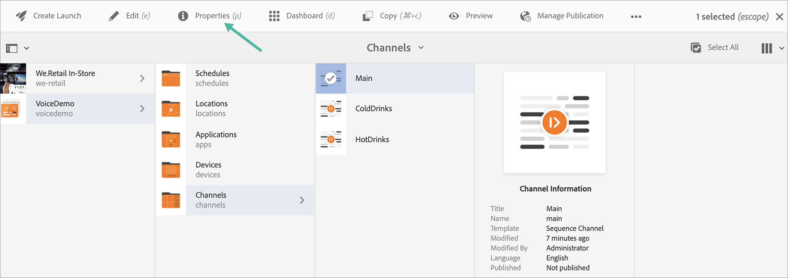
   
1. Navigate to the **Basics** tab, then click an existing tag from the **Tags** field, or create one.

   You can either create a tag by typing in a new name for your tag and hit `return` key, as shown in the figure below:

   

   Or,

   You can also create tags from your AEM instance beforehand for your project and select them. After you follow the steps explained in [Creating Tags](#creating-tags), you can click the tag from the location and add it to your channel, as shown in the figure below:

   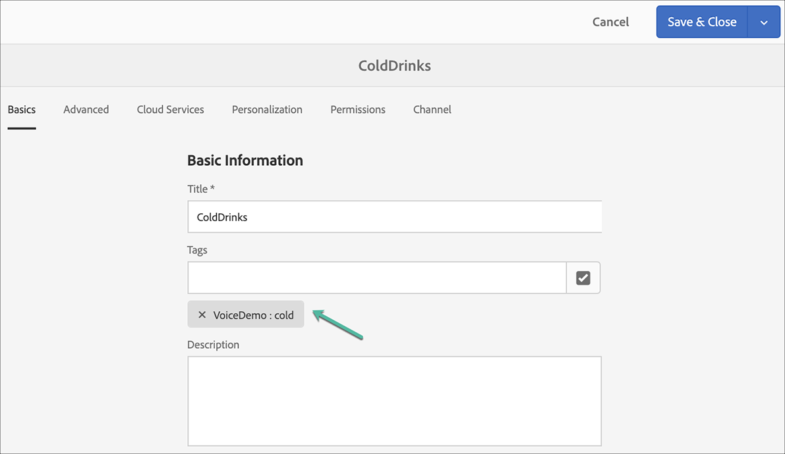

1. Similarly, add a tag titled as **hot** to the **HotDrinks** channel.

1. If you are using a Split Screens channel, add both the tags (**hot** and **cold**) to the **SplitScreen** channel properties, as shown in the figure below.

   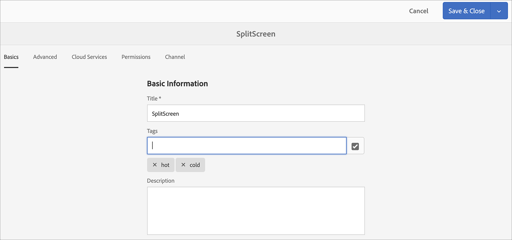

1. Click **Save & Close** once you are done.

### Creating Tags {#creating-tags}
   
Follow the steps below to create tags:

   1. Navigate to your AEM instance.

   1. Click the tools icon > **Tagging**.
       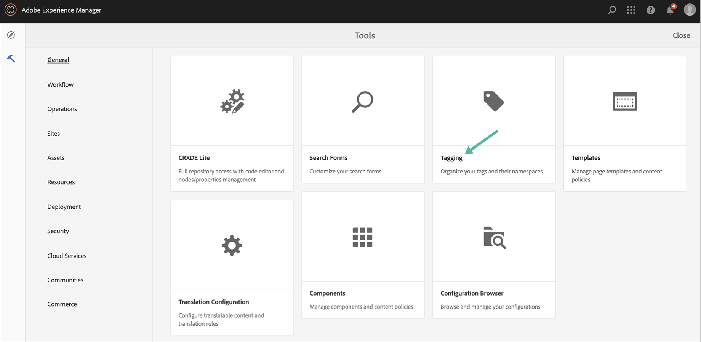

   1. Click **Create** > **Create Namespace**.
       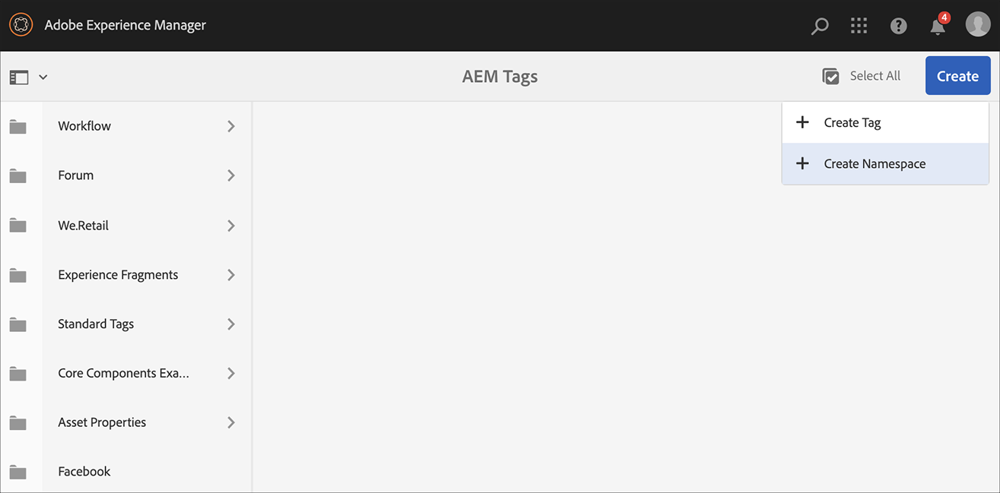

   1. Enter the name of your project, for example, **VoiceDemo** and click **Create**.

   1. Click the **VoiceDemo** project and click **Create Tag** from the action bar.
       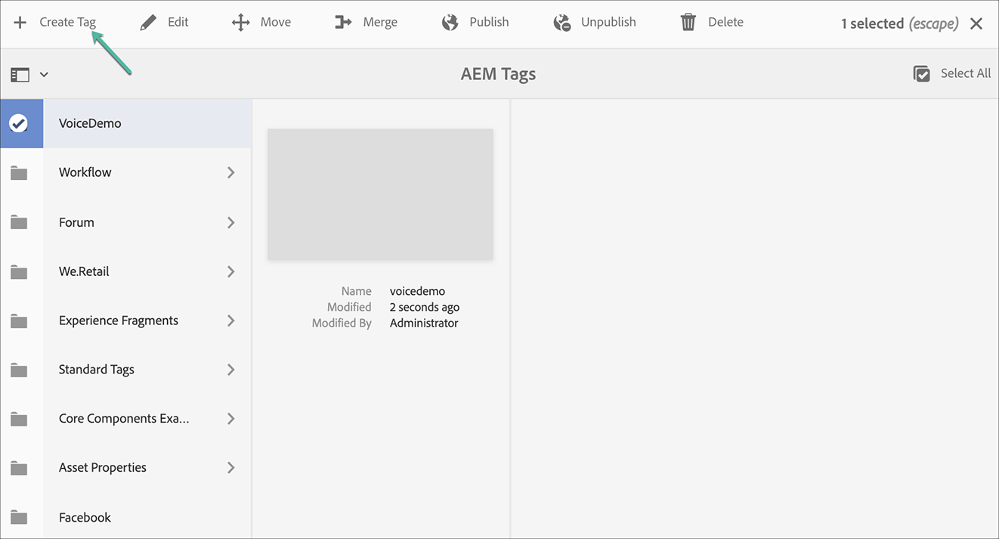

   1. Enter the name of your tag and click **Submit**.
       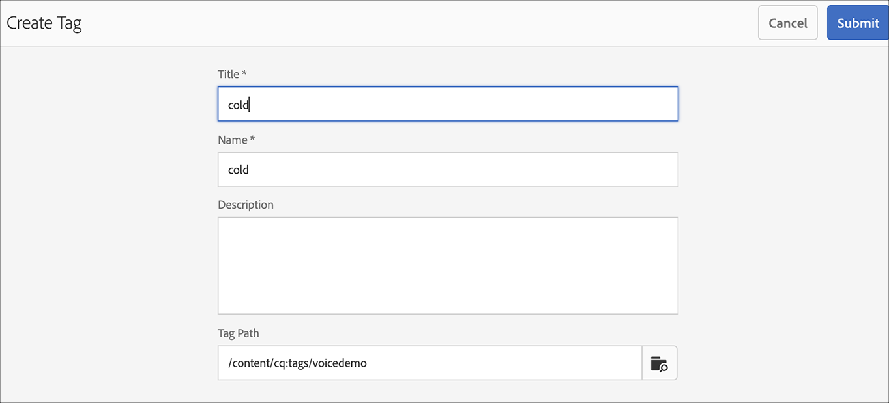

Now, you can use these tags in your AEM Screens project.

### Assigning Channel to a Display and Enabling Voice Recognition {#channel-assignment}

1. Create a display in the **Locations** folder, as shown in the figure below.

   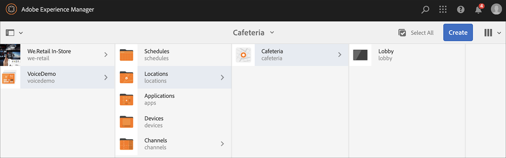

   >[!NOTE]
   >To learn how to assign a channel to a display, see [Creating and Managing Displays](/help/user-guide/managing-displays.md).
   
1. Assign the channels **Main**, **ColdDrinks**, and **HotDrinks** to your **LobbyDisplay**. Also, if you are using the **SplitScreen** channel for your project, make sure you assign that too to the display.

   >[!NOTE]
   >If you have created a split screen channel, assign the **SplitScreen** channel too to your display.
  
1. Set the following properties to each of the channel, while assigning the channel.

   |**Channel Name**|**Priority**|**Supported Events**|
   |---|---|---|
   |Main|2|Initial Load, Idle Screen, Timer|
   |HotDrinks|1|User Interaction|
   |ColdDrinks|1|User Interaction|
   |SplitScreen|1|User Interaction|

   >[!NOTE]
   >
   >To learn how to assign a channel to a display, see [Creating and Managing Displays](/help/user-guide/managing-displays.md).

1. After you have assigned channels to a display, navigate to the **LobbyDisplay** and click the display. Click **Properties** from the action bar.

1. Navigate to the **Display** tab and enable the **Voice enabled** option under **Content**.

   

   >[!IMPORTANT]
   >It is mandatory to enable the voice recognition feature from the display.

### Viewing the Content in the Chrome Player {#viewing-content}

When the preceding steps are completed, you can register your Chrome device to view the output.

>[!NOTE]
>See [Device Registration](device-registration.md).

**Desired Output for Sequence Channel**

The **Main** channel is playing its content. However, when you use words with the keyword **hot**, such as *I would like to have a hot drink*, the channel starts playing the contents of the **HotDrinks** channel.

Similarly, if you use a word with a keyword **cold** such as *I would like to have something cold*, the channel starts playing the contents of the **ColdDrinks** channel.

**Desired Output for Split Screens Channel**

The **Main** channel is playing its content. However, when you use words with the keyword **hot** and **cold** together, such as *I would like to see the menu for hot and cold beverages*, the channel plays the contents of the **SplitScreen** channel. If you say *back to the main menu*, it reverts to the **Main** channel.
